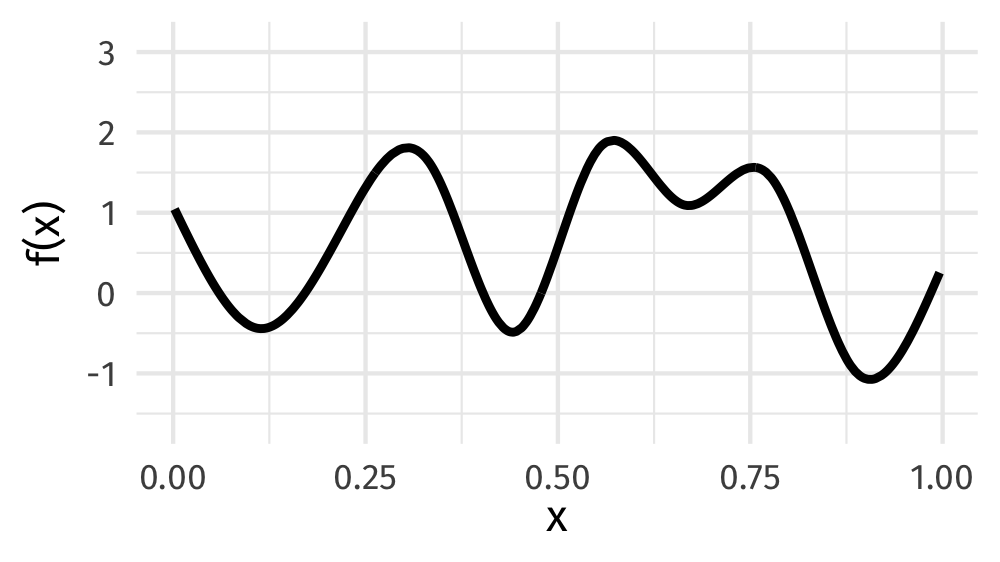
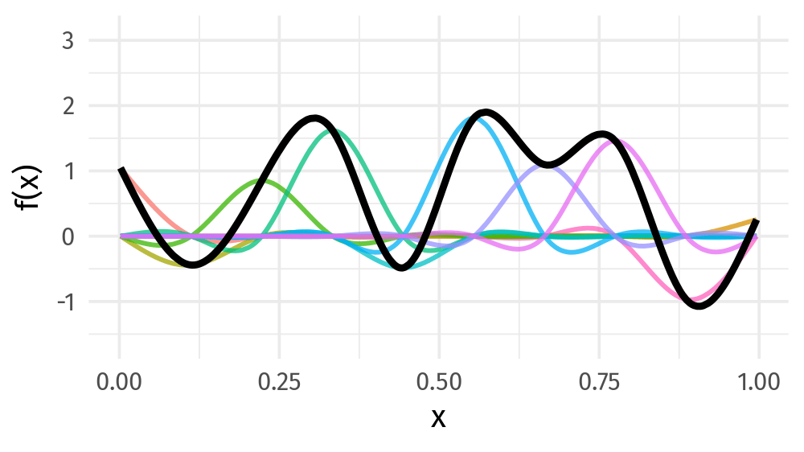
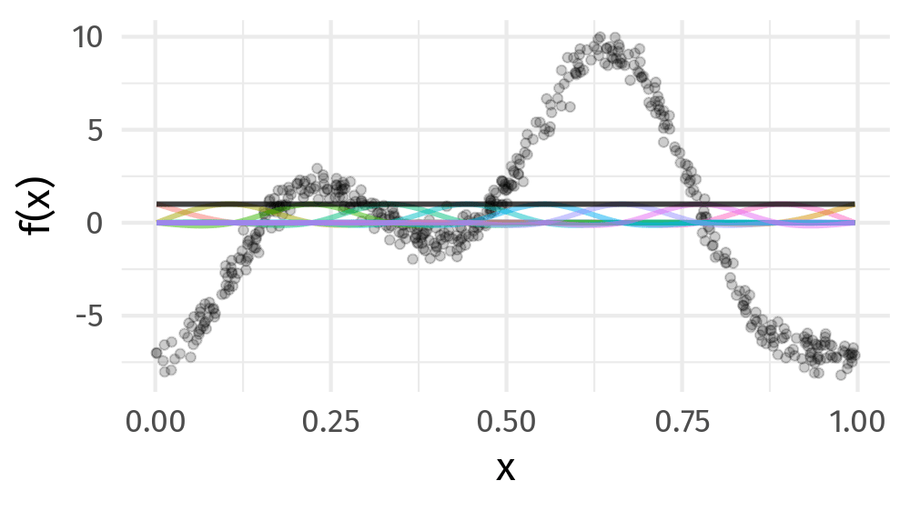

class: inverse middle center big-subsection

```{r setup, include=FALSE, cache=FALSE}
options(htmltools.dir.version = FALSE)
knitr::opts_chunk$set(cache = TRUE, dev = 'svg', echo = TRUE, message = FALSE, warning = FALSE,
                      fig.height = 6, fig.width = 1.777777 * 6)

library('here')
library('mgcv')
library('gratia')
library('ggplot2')
library('purrr')
library('mvnfast')
library("tibble")
library('patchwork')
library('tidyr')
library("knitr")
library("viridis")
library('readr')
library('dplyr')
library('gganimate')

## plot defaultsFriday 14th
theme_set(theme_bw(base_size = 16, base_family = 'Fira Sans'))

## constants
anim_width <- 1000
anim_height <- anim_width / 1.77777777
anim_dev <- 'png'
anim_res <- 200
```

# Welcome

???

---

# Logistics

## Slides

Slidedeck: [bit.ly/physalia-gam-2](https://bit.ly/physalia-gam-2)

Sources: [bit.ly/physalia-gam](https://bit.ly/physalia-gam)

Direct download a ZIP of everything: [bit.ly/physalia-gam-zip](https://bit.ly/physalia-gam-zip)

Unpack the zip & remember where you put it

---

# Today's topics

* How do GAMs work?

* What are splines?

* How do GAMs learn from data without overfitting?

---
class: inverse middle center huge-subsection

# GAMs

---
class: inverse middle center subsection

# Motivating example

---

# HadCRUT4 time series

```{r hadcrut-temp-example, echo = FALSE}
URL <- "https://bit.ly/hadcrutv4"
# data are year, median of ensemble runs, certain quantiles in remaining cols
# take only cols 1 and 2
gtemp <- read_table(URL, col_types = 'nnnnnnnnnnnn', col_names = FALSE) %>%
    select(num_range('X', 1:2)) %>% setNames(nm = c('Year', 'Temperature'))

## Plot
gtemp_plt <- ggplot(gtemp, aes(x = Year, y = Temperature)) +
    geom_line() + 
    geom_point() +
    labs(x = 'Year', y = expression(Temeprature ~ degree * C))
gtemp_plt
```

???

Hadley Centre NH temperature record ensemble

How would you model the trend in these data?

---

# (Generalized) Linear Models

$$y_i \sim \mathcal{N}(\mu_i, \sigma^2)$$

$$\mu_i = \beta_0 + \beta_1 \mathtt{year}_{i} + \beta_2 \mathtt{year}^2_{1i} + \cdots + \beta_j \mathtt{year}^j_{i}$$

Assumptions

1. linear effects of covariates are good approximation of the true effects
2. conditional on the values of covariates, $y_i | \mathbf{X} \sim \mathcal{N}(0, \sigma^2)$
3. this implies all observations have the same *variance*
4. $y_i | \mathbf{X}$ are *independent*

An **additive** model address the first of these

---
class: inverse center middle subsection

# Why bother with anything more complex?

---

# Is this linear?

```{r hadcrut-temp-example, echo = FALSE}
```

---

# Polynomials perhaps&hellip;

```{r hadcrut-temp-polynomial, echo = FALSE}
p <- c(1,3,8,15)
N <- 300
newd <- with(gtemp, data.frame(Year = seq(min(Year), max(Year), length = N)))
polyFun <- function(i, data = data) {
    lm(Temperature ~ poly(Year, degree = i), data = data)
}
mods <- lapply(p, polyFun, data = gtemp)
pred <- vapply(mods, predict, numeric(N), newdata = newd)
colnames(pred) <- p
newd <- cbind(newd, pred)
polyDat <- gather(newd, Degree, Fitted, - Year)
polyDat <- mutate(polyDat, Degree = ordered(Degree, levels = p))
gtemp_plt +
  geom_line(data = polyDat,
            mapping = aes(x = Year, y = Fitted, colour = Degree),
            size = 1.5, alpha = 0.9) +
    scale_color_brewer(name = "Degree", palette = "PuOr") +
    theme(legend.position = "right")
```

---

# Polynomials perhaps&hellip;

We can keep on adding ever more powers of $\boldsymbol{x}$ to the model &mdash; model selection problem

**Runge phenomenon** &mdash; oscillations at the edges of an interval &mdash; means simply moving to higher-order polynomials doesn't always improve accuracy

---
class: inverse middle center subsection

# GAMs offer a solution

---

# HadCRUT data set

```{r read-hadcrut, echo = TRUE}
library('readr')
library('dplyr')
URL <-  "https://bit.ly/hadcrutv4"
gtemp <- read_table(URL, col_types = 'nnnnnnnnnnnn', col_names = FALSE) %>%
    select(num_range('X', 1:2)) %>% setNames(nm = c('Year', 'Temperature'))
```

[File format](https://www.metoffice.gov.uk/hadobs/hadcrut4/data/current/series_format.html)

---

# HadCRUT data set

```{r show-hadcrut, echo = TRUE}
gtemp
```

---

# Fitting a GAM

```{r hadcrutemp-fitted-gam, echo = TRUE, results = 'hide'}
library('mgcv')
m <- gam(Temperature ~ s(Year), data = gtemp, method = 'REML')
summary(m)
```

.smaller[
```{r hadcrutemp-fitted-gam, echo = FALSE}
```
]

---

# Fitted GAM

```{r hadcrtemp-plot-gam, echo = FALSE}
N <- 300
newd <- as_tibble(with(gtemp, data.frame(Year = seq(min(Year), max(Year), length = N))))
pred <- as_tibble(as.data.frame(predict(m, newdata = newd, se.fit = TRUE,
                                        unconditional = TRUE)))
pred <- bind_cols(newd, pred) %>%
    mutate(upr = fit + 2 * se.fit, lwr = fit - 2*se.fit)

ggplot(gtemp, aes(x = Year, y = Temperature)) +
    geom_point() +
    geom_ribbon(data = pred,
                mapping = aes(ymin = lwr, ymax = upr, x = Year), alpha = 0.4, inherit.aes = FALSE,
                fill = "#fdb338") +
    geom_line(data = pred,
              mapping = aes(y = fit, x = Year), inherit.aes = FALSE, size = 1, colour = "#025196") +
    labs(x = 'Year', y = expression(Temeprature ~ degree*C))
```

---
class: inverse middle center big-subsection

# GAMs

---

# Generalized Additive Models

<br />


.references[Source: [GAMs in R by Noam Ross](https://noamross.github.io/gams-in-r-course/)]

???

GAMs are an intermediate-complexity model

* can learn from data without needing to be informed by the user
* remain interpretable because we can visualize the fitted features

---

# How is a GAM different?

$$\begin{align*}
y_i &\sim \mathcal{D}(\mu_i, \theta) \\ 
\mathbb{E}(y_i) &= \mu_i = g(\eta_i)^{-1}
\end{align*}$$

We model the mean of data as a sum of linear terms:

$$\eta_i = \beta_0 +\sum_j \color{red}{ \beta_j x_{ji}}$$

A GAM is a sum of _smooth functions_ or _smooths_

$$\eta_i = \beta_0 + \sum_j \color{red}{f_j(x_{ji})}$$

---

# How did `gam()` *know*?

```{r hadcrtemp-plot-gam, echo = FALSE}
```

---
class: inverse
background-image: url('./resources/rob-potter-398564.jpg')
background-size: contain

# What magic is this?

.footnote[
<a style="background-color:black;color:white;text-decoration:none;padding:4px 6px;font-family:-apple-system, BlinkMacSystemFont, &quot;San Francisco&quot;, &quot;Helvetica Neue&quot;, Helvetica, Ubuntu, Roboto, Noto, &quot;Segoe UI&quot;, Arial, sans-serif;font-size:12px;font-weight:bold;line-height:1.2;display:inline-block;border-radius:3px;" href="https://unsplash.com/@robpotter?utm_medium=referral&amp;utm_campaign=photographer-credit&amp;utm_content=creditBadge" target="_blank" rel="noopener noreferrer" title="Download free do whatever you want high-resolution photos from Rob Potter"><span style="display:inline-block;padding:2px 3px;"><svg xmlns="http://www.w3.org/2000/svg" style="height:12px;width:auto;position:relative;vertical-align:middle;top:-1px;fill:white;" viewBox="0 0 32 32"><title></title><path d="M20.8 18.1c0 2.7-2.2 4.8-4.8 4.8s-4.8-2.1-4.8-4.8c0-2.7 2.2-4.8 4.8-4.8 2.7.1 4.8 2.2 4.8 4.8zm11.2-7.4v14.9c0 2.3-1.9 4.3-4.3 4.3h-23.4c-2.4 0-4.3-1.9-4.3-4.3v-15c0-2.3 1.9-4.3 4.3-4.3h3.7l.8-2.3c.4-1.1 1.7-2 2.9-2h8.6c1.2 0 2.5.9 2.9 2l.8 2.4h3.7c2.4 0 4.3 1.9 4.3 4.3zm-8.6 7.5c0-4.1-3.3-7.5-7.5-7.5-4.1 0-7.5 3.4-7.5 7.5s3.3 7.5 7.5 7.5c4.2-.1 7.5-3.4 7.5-7.5z"></path></svg></span><span style="display:inline-block;padding:2px 3px;">Rob Potter</span></a>
]

---
class: inverse
background-image: url('resources/wiggly-things.png')
background-size: contain

---

# Fitting a GAM in R

```r
model <- gam(y ~ s(x1) + s(x2) + te(x3, x4), # formuala describing model
             data = my_data_frame,           # your data
             method = 'REML',                # or 'ML'
             family = gaussian)              # or something more exotic
```

`s()` terms are smooths of one or more variables

`te()` terms are the smooth equivalent of *main effects + interactions*

$$\eta_i = \beta_0 + f(\mathtt{Year}_i)$$

```r
library(mgcv)
gam(Temperature ~ s(Year, k = 10), data = gtemp, method = 'REML')
```

---

```{r smooth-fun-animation, results = FALSE, echo = FALSE}
f <- function(x) {
    x^11 * (10 * (1 - x))^6 + ((10 * (10 * x)^3) * (1 - x)^10)
}

draw_beta <- function(n, k, mu = 1, sigma = 1) {
    rmvn(n = n, mu = rep(mu, k), sigma = diag(rep(sigma, k)))
}

weight_basis <- function(bf, x, n = 1, k, ...) {
    beta <- draw_beta(n = n, k = k, ...)
    out <- sweep(bf, 2L, beta, '*')
    colnames(out) <- paste0('f', seq_along(beta))
    out <- as_tibble(out)
    out <- add_column(out, x = x)
    out <- pivot_longer(out, -x, names_to = 'bf', values_to = 'y')
    out
}

random_bases <- function(bf, x, draws = 10, k, ...) {
    out <- rerun(draws, weight_basis(bf, x = x, k = k, ...))
    out <- bind_rows(out)
    out <- add_column(out, draw = rep(seq_len(draws), each = length(x) * k),
                      .before = 1L)
    class(out) <- c("random_bases", class(out))
    out
}

plot.random_bases <- function(x, facet = FALSE) {
    plt <- ggplot(x, aes(x = x, y = y, colour = bf)) +
        geom_line(lwd = 1, alpha = 0.75) +
        guides(colour = FALSE)
    if (facet) {
        plt + facet_wrap(~ draw)
    }
    plt
}

normalize <- function(x) {
    rx <- range(x)
    z <- (x - rx[1]) / (rx[2] - rx[1])
    z
}

set.seed(1)
N <- 500
data <- tibble(x     = runif(N),
               ytrue = f(x),
               ycent = ytrue - mean(ytrue),
               yobs  = ycent + rnorm(N, sd = 0.5))

k <- 10
knots <- with(data, list(x = seq(min(x), max(x), length = k)))
sm <- smoothCon(s(x, k = k, bs = "cr"), data = data, knots = knots)[[1]]$X
colnames(sm) <- levs <- paste0("f", seq_len(k))
basis <- pivot_longer(cbind(sm, data), -(x:yobs), names_to = 'bf')
basis

set.seed(2)
bfuns <- random_bases(sm, data$x, draws = 20, k = k)

smooth <- bfuns %>%
    group_by(draw, x) %>%
    summarise(spline = sum(y)) %>%
    ungroup()

p1 <- ggplot(smooth) +
    geom_line(data = smooth, aes(x = x, y = spline), lwd = 1.5) +
    labs(y = 'f(x)', x = 'x') +
    theme_minimal(base_size = 16, base_family = 'Fira Sans')

smooth_funs <- animate(
    p1 + transition_states(draw, transition_length = 4, state_length = 2) + 
    ease_aes('cubic-in-out'),
    nframes = 200, height = anim_height, width = anim_width, res = anim_res, dev = anim_dev)

anim_save('resources/spline-anim.gif', smooth_funs)
```

# Wiggly things

.center[]

???

GAMs use splines to represent the non-linear relationships between covariates, here `x`, and the response variable on the `y` axis.

---

# Basis expansions

In the polynomial models we used a polynomial basis expansion of $\boldsymbol{x}$

* $\boldsymbol{x}^0 = \boldsymbol{1}$ &mdash; the model constant term
* $\boldsymbol{x}^1 = \boldsymbol{x}$ &mdash; linear term
* $\boldsymbol{x}^2$
* $\boldsymbol{x}^3$
* &hellip;

---

# Splines

Splines are *functions* composed of simpler functions

Simpler functions are *basis functions* & the set of basis functions is a *basis*

When we model using splines, each basis function $b_k$ has a coefficient $\beta_k$

Resultant spline is a the sum of these weighted basis functions, evaluated at the values of $x$

$$s(x) = \sum_{k = 1}^K \beta_k b_k(x)$$

---

# Splines formed from basis functions

```{r basis-functions, fig.height=6, fig.width = 1.777777*6, echo = FALSE}
ggplot(basis,
       aes(x = x, y = value, colour = bf)) +
    geom_line(lwd = 2, alpha = 0.5) +
    guides(colour = FALSE) +
    labs(x = 'x', y = 'b(x)') +
    theme_minimal(base_size = 20, base_family = 'Fira Sans')
```

???

Splines are built up from basis functions

Here I'm showing a cubic regression spline basis with 10 knots/functions

We weight each basis function to get a spline. Here all the basisi functions have the same weight so they would fit a horizontal line

---

# Weight basis functions &#8680; spline

```{r basis-function-animation, results = 'hide', echo = FALSE}
bfun_plt <- plot(bfuns) +
    geom_line(data = smooth, aes(x = x, y = spline),
              inherit.aes = FALSE, lwd = 1.5) +
    labs(x = 'x', y = 'f(x)') +
    theme_minimal(base_size = 14, base_family = 'Fira Sans')

bfun_anim <- animate(
    bfun_plt + transition_states(draw, transition_length = 4, state_length = 2) + 
    ease_aes('cubic-in-out'),
    nframes = 200, height = anim_height, width = anim_width, res = anim_res, dev = anim_dev)

anim_save('resources/basis-fun-anim.gif', bfun_anim)
```

.center[]

???

But if we choose different weights we get more wiggly spline

Each of the splines I showed you earlier are all generated from the same basis functions but using different weights

---

# How do GAMs learn from data?

```{r example-data-figure, fig.height=6, fig.width = 1.777777*6, echo = FALSE}
data_plt <- ggplot(data, aes(x = x, y = ycent)) +
    geom_line(col = 'goldenrod', lwd = 2) +
    geom_point(aes(y = yobs), alpha = 0.2, size = 3) +
    labs(x = 'x', y = 'f(x)') +
    theme_minimal(base_size = 20, base_family = 'Fira Sans')
data_plt
```

???

How does this help us learn from data?

Here I'm showing a simulated data set, where the data are drawn from the orange functions, with noise. We want to learn the orange function from the data

---

# Maximise penalised log-likelihood &#8680; &beta;

```{r basis-functions-anim, results = "hide", echo = FALSE}
sm2 <- smoothCon(s(x, k = k, bs = "cr"), data = data, knots = knots)[[1]]$X
beta <- coef(lm(ycent ~ sm2 - 1, data = data))
wtbasis <- sweep(sm2, 2L, beta, FUN = "*")
colnames(wtbasis) <- colnames(sm2) <- paste0("F", seq_len(k))
## create stacked unweighted and weighted basis
basis <- as_tibble(rbind(sm2, wtbasis)) %>%
    add_column(x = rep(data$x, times = 2),
               type = rep(c('unweighted', 'weighted'), each = nrow(sm2)),
               .before = 1L)
##data <- cbind(data, fitted = rowSums(scbasis))
wtbasis <- as_tibble(rbind(sm2, wtbasis)) %>%
    add_column(x      = rep(data$x, times = 2),
               fitted = rowSums(.),
               type   = rep(c('unweighted', 'weighted'), each = nrow(sm2))) %>%
    pivot_longer(-(x:type), names_to = 'bf')
basis <- pivot_longer(basis, -(x:type), names_to = 'bf')

p3 <- ggplot(data, aes(x = x, y = ycent)) +
    geom_point(aes(y = yobs), alpha = 0.2) +
    geom_line(data = basis,
              mapping = aes(x = x, y = value, colour = bf),
              lwd = 1, alpha = 0.5) +
    geom_line(data = wtbasis,
              mapping = aes(x = x, y = fitted), lwd = 1, colour = 'black', alpha = 0.75) +
    guides(colour = FALSE) +
    labs(y = 'f(x)', x = 'x') +
    theme_minimal(base_size = 16, base_family = 'Fira Sans')

crs_fit <- animate(p3 + transition_states(type, transition_length = 4, state_length = 2) + 
                   ease_aes('cubic-in-out'),
                   nframes = 100, height = anim_height, width = anim_width, res = anim_res,
                   dev = anim_dev)

anim_save('./resources/gam-crs-animation.gif', crs_fit)
```

.center[]

???

Fitting a GAM involves finding the weights for the basis functions that produce a spline that fits the data best, subject to some constraints


---
class: inverse middle center subsection

# Avoid overfitting our sample

---
class: inverse center middle large-subsection

# How wiggly?

$$
\int_{\mathbb{R}} [f^{\prime\prime}]^2 dx = \boldsymbol{\beta}^{\mathsf{T}}\mathbf{S}\boldsymbol{\beta}
$$

---
class: inverse center middle large-subsection

# Penalised fit

$$
\mathcal{L}_p(\boldsymbol{\beta}) = \mathcal{L}(\boldsymbol{\beta}) - \frac{1}{2} \lambda\boldsymbol{\beta}^{\mathsf{T}}\mathbf{S}\boldsymbol{\beta}
$$

---

# Wiggliness

$$\int_{\mathbb{R}} [f^{\prime\prime}]^2 dx = \boldsymbol{\beta}^{\mathsf{T}}\mathbf{S}\boldsymbol{\beta} = \large{W}$$

(Wiggliness is 100% the right mathy word)

We penalize wiggliness to avoid overfitting

---

# Making wiggliness matter

$W$ measures **wiggliness**

(log) likelihood measures closeness to the data

We use a **smoothing parameter** $\lambda$ to define the trade-off, to find
the spline coefficients $B_k$ that maximize the **penalized** log-likelihood

$$\mathcal{L}_p = \log(\text{Likelihood})  - \lambda W$$

---

# HadCRUT4 time series

```{r hadcrut-temp-penalty, echo = FALSE}
K <- 40
lambda <- c(10000, 1, 0.01, 0.00001)
N <- 300
newd <- with(gtemp, data.frame(Year = seq(min(Year), max(Year), length = N)))
fits <- lapply(lambda, function(lambda) gam(Temperature ~ s(Year, k = K, sp = lambda), data = gtemp))
pred <- vapply(fits, predict, numeric(N), newdata = newd)
op <- options(scipen = 100)
colnames(pred) <- lambda
newd <- cbind(newd, pred)
lambdaDat <- gather(newd, Lambda, Fitted, - Year)
lambdaDat <- transform(lambdaDat, Lambda = factor(paste("lambda ==", as.character(Lambda)),
                                                  levels = paste("lambda ==", as.character(lambda))))

gtemp_plt + geom_line(data = lambdaDat, mapping = aes(x = Year, y = Fitted, group = Lambda),
                      size = 1, colour = "#e66101") +
    facet_wrap( ~ Lambda, ncol = 2, labeller = label_parsed)
options(op)
```

---

# Picking the right wiggliness

.pull-left[
Two ways to think about how to optimize $\lambda$:

* Predictive: Minimize out-of-sample error
* Bayesian:  Put priors on our basis coefficients
]

.pull-right[
Many methods: AIC, Mallow's $C_p$, GCV, ML, REML

* **Practically**, use **REML**, because of numerical stability
* Hence `gam(..., method='REML')`
]

.center[

]

---

# Maximum allowed wiggliness

We set **basis complexity** or "size" $k$

This is _maximum wigglyness_, can be thought of as number of small functions that make up a curve

Once smoothing is applied, curves have fewer **effective degrees of freedom (EDF)**

EDF < $k$

---

# Maximum allowed wiggliness

$k$ must be *large enough*, the $\lambda$ penalty does the rest

*Large enough* &mdash; space of functions representable by the basis includes the true function or a close approximation to the true function

Bigger $k$ increases computational cost

In **mgcv**, default $k$ values are arbitrary &mdash; after choosing the model terms, this is the key user choice

**Must be checked!** &mdash; `k.check()`


---

# GAM summary so far

1. GAMs give us a framework to model flexible nonlinear relationships

2. Use little functions (**basis functions**) to make big functions (**smooths**)

3. Use a **penalty** to trade off wiggliness/generality 

4. Need to make sure your smooths are **wiggly enough**

---
class: middle center inverse subsection

# Example

---

# Portugese larks

.row[
.col-7[

```{r birds-1, echo = TRUE}
library("here"); library("readr"); library("dplyr")
larks <-  read_csv(here("data", "larks.csv"),
                   col_types = "ccdddd")

larks <- larks %>%
  mutate(crestlark = factor(crestlark),
         linnet = factor(linnet),
         e = x / 1000,
         n = y / 1000)
head(larks)
```
]

.col-5[

```{r birds-2, fig.width = 5, fig.height = 6, echo = FALSE}
ggplot(larks, aes(x = e, y = n, colour = crestlark)) + geom_point(size = 0.5) +
  coord_fixed() + scale_colour_discrete(na.value = '#bbbbbb33') +
  labs(x = NULL, y = NULL)
```
]
]

---
 
# Portugese larks &mdash; binomial GAM

.row[
.col-6[
```{r birds-gam-1, echo = TRUE}
crest <- gam(crestlark ~ s(e, n, k = 100),
             data = larks,
             family = binomial,
             method = 'REML')
```

$f(e, n)$ indicated by `s(e, n)` in the formula

Isotropic thin plate spline

`k` sets size of basis dimension; upper limit on EDF

Smoothness parameters estimated via REML
]

.col-6[
.smaller[
```{r birds-gam-2, echo = TRUE}
summary(crest)
```
]
]
]

---

# Portugese larks &mdash; binomial GAM

Model checking with binary data is a pain &mdash; residuals look weird

Alternatively we can aggregate data at the `QUADRICULA` level & fit a binomial count model

.smaller[
```{r munge-larks, echo = TRUE}
larks2 <- larks %>%
  mutate(crestlark = as.numeric(as.character(crestlark)),  # to numeric
         linnet = as.numeric(as.character(linnet)),
         tet_n = rep(1, nrow(larks)),                      # counter for how many grid cells (tetrads) we sum
         N = rep(1, nrow(larks)),                          # number of observations, 1 per row currently
         N = if_else(is.na(crestlark), NA_real_, N)) %>%   # set N to NA if observation taken
  group_by(QUADRICULA) %>%                                 # group by the larger grid square
  summarise(across(c(N, crestlark, linnet, tet_n, e, n),
                   ~ sum(., na.rm = TRUE))) %>%            # sum all needed variables
  mutate(e = e / tet_n, n = n / tet_n)                     # rescale to get avg E,N coords for QUADRICULA

## fit binomial GAM
crest2 <- gam(cbind(crestlark, N - crestlark) ~ s(e, n, k = 100),
              data = larks2, family = binomial, method = 'REML')
```
]

---

# Model checking

.pull-left[
.smaller[
```{r crest-3, echo = TRUE}
crest3 <- gam(cbind(crestlark, N - crestlark) ~
                s(e, n, k = 100),
              data = larks2, family = quasibinomial,
              method = 'REML')
crest3$scale # should be == 1
```
]

Model residuals don't look too bad

Bands of points due to integers

Some overdispersion &mdash; &phi; = `r round(crest3$scale,2)`
]

.pull-right[
```{r gam-check-aggregated-lark, echo = TRUE, fig.width = 4.5, fig.height = 4}
ggplot(tibble(Fitted = fitted(crest2),
              Resid = resid(crest2)),
       aes(Fitted, Resid)) + geom_point()
```
]
---
class: inverse middle center subsection

# South Pole CO<sub>2</sub>

---

# Atmospheric CO<sub>2</sub>

```{r co2-example-1, echo = TRUE}
library("gratia")
south <- read_csv(here("data", "south_pole.csv"), col_types = "ddd")
south
```

---

# Atmospheric CO<sub>2</sub>

```{r co2-example-2, echo = TRUE, fig.align = "center", out.width = "95%"}
ggplot(south, aes(x = c.month, y = co2)) + geom_line()
```

---

# Atmospheric CO<sub>2</sub> &mdash; fit naive GAM

.smaller[
```{r co2-example-3, echo = TRUE}
m_co2 <- gam(co2 ~ s(c.month, k = 300, bs = "cr"), data = south, method = 'REML')
summary(m_co2)
```
]

---

# Atmospheric CO<sub>2</sub> &mdash; predict

Predict the next 36 months

```{r co2-example-4, echo = TRUE}
new_df <- with(south, tibble(c.month = 1:(nrow(south) + 36)))
fv <- fitted_values(m_co2, data = new_df, scale = "response")
fv
```

---

# Atmospheric CO<sub>2</sub> &mdash; predict

```{r co2-example-5, echo = TRUE, fig.height = 5}
ggplot(fv, aes(x = c.month, y = fitted)) +
    geom_ribbon(aes(ymin = lower, ymax = upper), alpha = 0.2) +
    geom_line(data = south, aes(c.month, co2), col = 'red') +
    geom_line(alpha = 0.4)
```

---

# Atmospheric CO<sub>2</sub> &mdash; better model

Decompose into

1. a seasonal smooth
2. a long term trend

```{r co2-example-6, echo = TRUE}
m2_co2 <- gam(co2 ~ s(month, bs = "cc") + s(c.month, bs = "cr", k = 300),
              data = south, method = 'REML',
              knots = list(month = c(0.5, 12.5)))
```

---

# Atmospheric CO<sub>2</sub> &mdash; better model

.smaller[
```{r co2-example-7, echo = TRUE}
summary(m2_co2)
```
]

---

# Atmospheric CO<sub>2</sub> &mdash; predict

```{r co2-example-8, echo = TRUE}
nr <- nrow(south)
new_df <- with(south,
               tibble(c.month = 1:(nr + 36),
                      month = rep(seq_len(12), length = nr + 36)))
fv2 <- fitted_values(m2_co2, data = new_df, scale = "response")
fv2
```

---

# Atmospheric CO<sub>2</sub> &mdash; predict

```{r co2-example-9, echo = TRUE, fig.height = 5}
ggplot(fv2, aes(x = c.month, y = fitted)) +
    geom_ribbon(aes(ymin = lower, ymax = upper), alpha = 0.2) +
    geom_line(data = south, aes(c.month, co2), col = 'red') +
    geom_line(alpha = 0.4)
```

---

# A bestiary of conditional distributions

A GAM is just a fancy GLM

Simon Wood & colleagues (2016) have extended the *mgcv* methods to some non-exponential family distributions

.row[
.col-5[
* `binomial()`
* `poisson()`
* `Gamma()`
* `inverse.gaussian()`
* `nb()`
* `tw()`
* `mvn()`
]
.col-4[
* `multinom()`
* `betar()`
* `scat()`
* `gaulss()`
* `ziplss()`
* `twlss()`
* `cox.ph()`
]
.col-3[
* `gevlss()`
* `gamals()`
* `ocat()`
* `shash()`
* `gumbls()`
* `cnorm()`
* `ziP()`
]
]

---

# A cornucopia of smooths

The type of smoother is controlled by the `bs` argument (think *basis*)

The default is a low-rank thin plate spline `bs = 'tp'`

Many others available

.small[
.row[
.col-6[

* Cubic splines `bs = 'cr'`
* P splines `bs = 'ps'`
* Cyclic splines `bs = 'cc'` or `bs = 'cp'`
* Adaptive splines `bs = 'ad'`
* Random effect `bs = 're'`
* Factor smooths `bs = 'fs'`
]
.col-6[

* Duchon splines `bs = 'ds'`
* Spline on the sphere `bs = 'sos'`
* MRFs `bs = 'mrf'`
* Soap-film smooth `bs = 'so'`
* Gaussian process `bs = 'gp'`
* Constrained factor smooth `bs = 'sz'`
]
]
]

---

# Thin plate splines

Default spline in {mgcv} is `bs = "tp"`

Thin plate splines &mdash; knot at every unique data value

Penalty on wiggliness (default is 2nd derivative)

As many basis functions as data

This is wasteful

---

# Low rank thin plate splines

Thin plate regression spline

Form the full TPS basis

Take the wiggly basis functions and eigen-decomposition

Concentrates the *information* in the TPS basis into as few as possible new basis functions

Retain the `k` eigenvectors with the `k` largest eigenvalues as the new basis

Fit the GAM with those new basis functions

---

# Simulated Motorcycle Accident

A data frame giving a series of measurements of head acceleration in a simulated motorcycle accident, used to test crash helmets

```{r}
library("dplyr")
data(mcycle, package = "MASS")
mcycle <- as_tibble(mcycle)
mcycle
```
---

# Simulated Motorcycle Accident

.row[
.col-6[
```{r plot-mcycle, eval = FALSE}
plt <- mcycle %>%
  ggplot(aes(x = times, y = accel)) +
    geom_point() +
    labs(x = "Milliseconds after impact",
         y = expression(italic(g)))
plt
```
]

.col-6[
```{r plot-mcycle, fig.width = 6, fig.height = 4, echo = FALSE}
```
]
]

---

# TPRS basis

```{r}
new_df <- with(mcycle, tibble(times = evenly(times, n = 100)))
bfun <- basis(s(times), data = new_df)
bfun
```

---

# TPRS basis

```{r draw-tprs-basis, fig.show = "hide"}
draw(bfun)
```
.center[
```{r draw-tprs-basis, out.width = "95%", echo = FALSE}
```
]

---

# TPRS basis

```{r draw-tprs-basis-facetted, fig.show = "hide"}
draw(bfun) + facet_wrap(~ bf)
```
.center[
```{r draw-tprs-basis-facetted, out.width = "90%", echo = FALSE}
```
]

---

# Cubic regression splines

A CRS is composed of piecewise cubic polynomials over intervals of the data

The intervals are defined by knots

The individual cubic polynomials join at the knots so that resulting curve is continuous up to the second derivative

In {mgcv} the knot location are at evenly-spaced *quantiles* of the covariate &mdash; not evenly through the data

---

# Cubic regression splines

```{r, out.width = "90%", fig.align = "center"}
bfun <- basis(s(times, bs = "cr"), data = new_df)
draw(bfun) + facet_wrap(~ bf)
```

---

# Cubic regression splines

```{r, echo = FALSE, out.width = "95%", fig.align = "center"}
K <- 7
knots <- with(mcycle, list(times = evenly(times, n = K)))
bfun <- basis(s(times, bs = "cr", k = K), data = new_df, knots = knots)
draw(bfun) + facet_wrap(~ bf) +
  geom_rug(data = as.data.frame(knots), aes(x = times), sides = "b", inherit.aes = FALSE) +
  geom_hline(yintercept = 0, alpha = 0.5)
```

---

# Cubic regression splines

Use can specify the knot locations using the `knots` argument to the `gam()` function

`knots` takes a named list, with names equal to the covariate(s) you want to set the knot locations for

```{r}
## how many basis functions?
K <- 7

## create the knots list
knots <- with(mcycle,
              list(times = evenly(times, n = K)))

## provide `knots` to functions
bfun <- basis(s(times, bs = "cr", k = K), data = new_df, knots = knots)

model <- gam(accel ~ s(times, bs = "cr", k = K),
             data = mcycle, method = "REML",
             knots = knots) # <- specify knots to the model
```

---

# Cyclic cubic regression splines

Cyclic cubic regression splines are CRS but with the additional constraint that curve is continuous to the 2nd derivative *at the end points of the data range*

Specify the basis with `bs = "cc"`

```{r cc-basis-default, results = FALSE}
month_df <- with(south, tibble(month = evenly(month, n = 100)))
bfun <- basis(s(month, bs = "cc"), data = month_df)
```

---

# Cyclic cubic regression splines

```{r draw-crs-basis-facetted, fig.align = "center", out.width = "95%"}
draw(bfun) + facet_wrap(~ bf)
```

---

# Cyclic cubic regression splines

A problem for `month` as we don't expect December & January to be *exactly* the same

Set the outer knots

```{r plot-cc-basis, eval = FALSE}
knots <- list(month = c(0.5, 12.5))
bfun <- basis(s(month, bs = "cc"), data = month_df, knots = knots)
draw(bfun) + facet_wrap(~ bf)
```

---

# Cyclic cubic regression splines

```{r plot-cc-basis, echo = FALSE}
```

---

# The whole process 1

```{r whole-basis-proces, echo = FALSE, fig.height = 4, fig.width = 1.777777 * 6}
K <- 13
df <- data.frame(x = seq(0, 1, length = 200))
knots <- data.frame(x = seq(0, 1, length.out = 11))
bs <- basis(s(x, bs = "ps", k = K), data = df,
    knots = list(x = seq(-3, 13) / 10))

# let's weight the basis functions (simulating model coefs)
set.seed(1)
betas <- data.frame(bf = factor(seq_len(K)), beta = rnorm(K))

unwtd_bs_plt <- bs |>
    draw() +
    geom_vline(aes(xintercept = x), data = knots, linetype = "dotted",
        alpha = 0.5)

# we need to merge the weights for each basis function with the basis object
bs <- bs |>
    left_join(betas, by = join_by("bf" == "bf")) |>
    mutate(value_w = value * beta)

# weighted basis
wtd_bs_plt <- bs |>
    ggplot(aes(x = x, y = value_w, colour = bf, group = bf)) +
    geom_line(show.legend = FALSE) +
    geom_vline(aes(xintercept = x), data = knots, linetype = "dotted",
        alpha = 0.5) +
    labs(y = expression(f(x)), x = "x")

# now we want to sum the weighted basis functions for each value of `x`
spl <- bs |>
    group_by(x) |>
    summarise(spline = sum(value_w))

take <- c(83, 115)
pts <- bs |>
    group_by(bf) |>
    slice(take)

# now plot
bs_plt <- bs |>
    ggplot(aes(x = x, y = value_w, colour = bf, group = bf)) +
    geom_line(show.legend = FALSE) +
    geom_line(aes(x = x, y = spline), data = spl, linewidth = 1.25,
              inherit.aes = FALSE) +
    geom_vline(aes(xintercept = x), data = knots, linetype = "dotted",
        alpha = 0.5) +
    geom_vline(xintercept = c(df$x[take]), linetype = "dashed",
        alpha = 1) +
    geom_point(data = pts, aes(x = x, y = value_w, colour = bf, group = bf),
        size = 2, show.legend = FALSE) +
    geom_point(data = slice(spl, take), aes(x = x, y = spline),
        size = 3, colour = "red", inherit.aes = FALSE) +
    labs(y = expression(f(x)), x = "x")

unwtd_bs_plt + wtd_bs_plt + bs_plt + plot_layout(ncol = 3)
```

---

# The whole process 2

```{r whole-basis-proces-2-model}
dat <- data_sim("eg1", seed = 4)
m <- gam(y ~ s(x0) + s(x1) + s(x2, bs = "bs") + s(x3),
         data = dat, method = "REML")
```

```{r whole-basis-proces-2-model-draw, fig.height = 5, fig.width = 1.777777 * 6}
draw(m) + plot_layout(ncol = 4)
```

---

# The whole process 3

```{r whole-basis-proces-2, echo = FALSE, fig.height = 6, fig.width = 1.777777 * 6}
# data to evaluate the basis at
# using the CRAN version of {gratia}, we need `m`
ds <- data_slice(m, x2 = evenly(x2, n = 200))
# from 0.9.0 (or current GitHub version) you can do
# ds <- data_slice(dat, x2 = evenly(x2, n = 200))

# generate a tidy representation of the fitted basis functions
x2_bs <- basis(m, term = "s(x2)", data = ds)

# compute values of the spline by summing basis functions at each x2
x2_spl <- x2_bs |>
    group_by(x2) |>
    summarise(spline = sum(value))

# evaluate the spline at the same values as we evaluated the basis functions
x2_sm <- smooth_estimates(m, "s(x2)", data = ds) |>
    add_confint()

take <- c(65, 175)
pts <- x2_bs |>
    group_by(bf) |>
    slice(take)

# now plot
x2_bs |>
    ggplot(aes(x = x2, y = value, colour = bf, group = bf)) +
    geom_line(show.legend = FALSE) +
    geom_ribbon(aes(x = x2, ymin = lower_ci, ymax = upper_ci),
                data = x2_sm,
                inherit.aes = FALSE, alpha = 0.2) +
    geom_line(aes(x = x2, y = est), data = x2_sm,
              linewidth = 1.5, inherit.aes = FALSE) +
    geom_vline(xintercept = c(ds$x2[take]), linetype = "dashed",
        alpha = 1) +
    geom_point(data = pts, aes(x = x2, y = value, colour = bf, group = bf),
        size = 2, show.legend = FALSE) +
    geom_point(data = slice(x2_sm, take), aes(x = x2, y = est),
        size = 3, colour = "red", inherit.aes = FALSE) +
    labs(y = expression(f(x2)), x = "x2")
```

---
class: inverse middle center big-subsection

# Penalties

---

# How wiggly?

$$
\int_{\mathbb{R}} [f^{\prime\prime}]^2 dx = \boldsymbol{\beta}^{\mathsf{T}}\mathbf{S}\boldsymbol{\beta}
$$

$\mathbf{S}$ is known as the penalty matrix

Penalty matrix doesn't have to be derivative based &mdash; *P-splines*

As long as we can write $\mathbf{S}$ so that it measures the complexity of smooth as a function of the parameters of the smooth we're OK

---

# TPRS basis

```{r, out.width = "85%", fig.align = "center"}
new_df <- with(mcycle, tibble(times = evenly(times, n = 100)))
bfun <- basis(s(times), data = new_df, constraints = TRUE)
draw(bfun) + facet_wrap(~ bf)
```

---

# TPRS basis

```{r}
m <-  gam(accel ~ s(times), dat = mcycle, method = "REML")
S <- penalty(m, smooth = "s(times)")
S
```

---

# TPRS basis & penalty

.center[
```{r, echo = FALSE, dev = "png", out.width = "100%", dpi = 300}
library("patchwork")
p1 <- draw(bfun) + facet_wrap(~ bf)
p2 <- draw(S)
p1 + p2 + plot_layout(ncol = 2)
```
]
---

# CRS basis & penalty

```{r}
m <-  gam(accel ~ s(times, bs = "cr"), data = mcycle, method = "REML")
S <- penalty(m, smooth = "s(times)")
# draw(S)
```

---

# CRS basis & penalty

.center[
```{r, echo = FALSE, dev = "png", out.width = "100%", dpi = 300}
library("patchwork")
bfun_cc <- basis(s(times, bs = "cr"), data = new_df, constraints = TRUE)
p1 <- draw(bfun_cc) + facet_wrap(~ bf)
p2 <- draw(S)
p1 + p2 + plot_layout(ncol = 2)
```
]

---
class: inverse middle center big-subsection

# gratia 📦

---

# gratia 📦

{gratia} is a package for working with GAMs

Mostly limited to GAMs fitted with {mgcv} & {gamm4}

Follows (sort of) Tidyverse principles

* return tibbles (data frames)

* suitable for plotting with {ggplot2}

* graphics use {ggplot2} and {patchwork}

---

# `draw()`

The main function is `draw()`

Has methods for many of the function outputs in {gratia} and for models

---

# Plotting smooths

```{r draw-mcycle, out.width = "90%", fig.align = "center"}
m <- gam(accel ~ s(times), data = mcycle, method = "REML")
draw(m)
```


---

# Plotting smooths

```{r draw-four-fun-sim, fig.show = "hide"}
df <- data_sim("eg1", n = 1000, seed = 42)
df
m_sim <- gam(y ~ s(x0) + s(x1) + s(x2) + s(x3),
             data = df, method = "REML")
draw(m_sim)
```

---

# Plotting smooths

.center[
```{r draw-four-fun-sim-plot, echo = FALSE, out.width = "95%"}
draw(m_sim)
```
]

---

# Plotting smooths

```{r draw-mcycle-options, fig.show = "hide"}
draw(m_sim,
     residuals = TRUE,           # add partial residuals
     overall_uncertainty = TRUE, # include uncertainty due to constant
     unconditional = TRUE,       # correct for smoothness selection
     rug = FALSE)                # turn off rug plot
```

---

# Plotting smooths

.center[
```{r draw-mcycle-options-plot, out.width = "95%", echo = FALSE}
draw(m_sim, residuals = TRUE, overall_uncertainty = TRUE,
     unconditional = TRUE, rug = FALSE)
```
]
