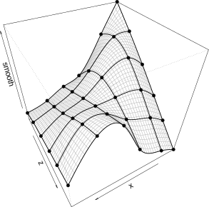
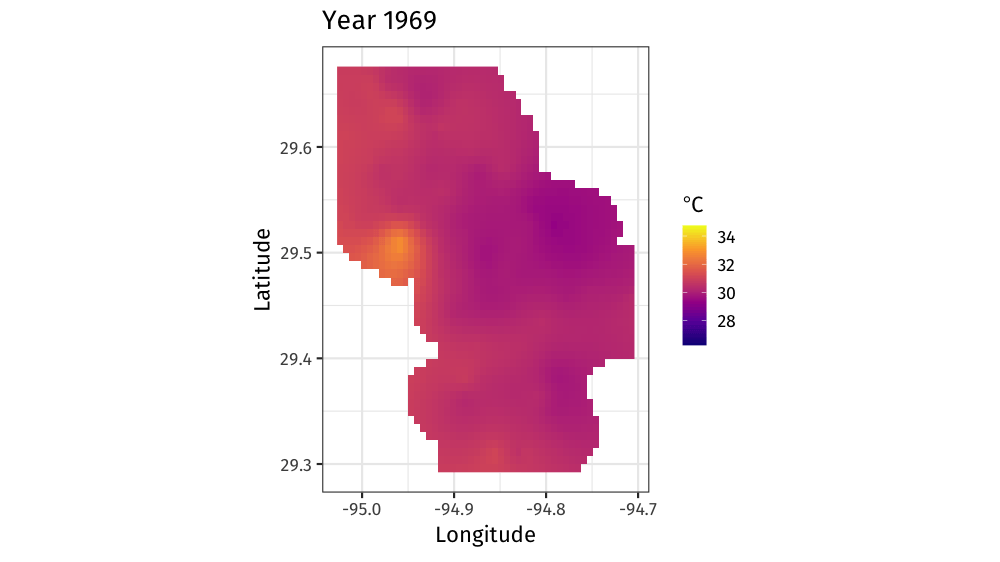

class: inverse middle center big-subsection

```{r setup, include=FALSE, cache=FALSE}
options(htmltools.dir.version = FALSE)
knitr::opts_chunk$set(cache = TRUE, dev = "svg", echo = TRUE, message = FALSE, 
  warning = FALSE, fig.height = 6, fig.width = 1.777777 * 6)

library("gridGraphics")
library('here')
library('mgcv')
library('gratia')
library('ggplot2')
library('purrr')
library('mvnfast')
library("tibble")
library('patchwork')
library('tidyr')
library("knitr")
library("viridis")
library('readr')
library('dplyr')
library('gganimate')

## plot defaults
theme_set(theme_bw(base_size = 16, base_family = 'Fira Sans'))

## constants
anim_width <- 1000
anim_height <- anim_width / 1.77777777
anim_dev <- 'png'
anim_res <- 200
```

# Day 3

???

---

# Logistics

## Slides

Slidedeck: [bit.ly/physalia-gam-3](https://bit.ly/physalia-gam-3)

Sources: [bit.ly/physalia-gam](https://bit.ly/physalia-gam)

Direct download a ZIP of everything: [bit.ly/physalia-gam-zip](https://bit.ly/physalia-gam-zip)

Unpack the zip & remember where you put it

---

# Matters arising

1. Basis functions for `s(x, z)`

2. Testing for non-linearity beyond a linear effect

3. Derivatives of smooths

---

# Basis functions for `s(x, z)`

Code for this is in `day-2/test.R`

```{r tprs-2d-basis-setup, echo = FALSE}
test_fun2 <- function(n = 50, sx = 0.3, sz = 0.4, scale = 0.1,
                     seed = NULL) {
    require("tibble")
    if (!exists(".Random.seed", envir = .GlobalEnv, inherits = FALSE)) {
        runif(1)
    }
    if (is.null(seed)) {
        RNGstate <- get(".Random.seed", envir = .GlobalEnv)
    }
    else {
        R.seed <- get(".Random.seed", envir = .GlobalEnv)
        set.seed(seed)
        RNGstate <- structure(seed, kind = as.list(RNGkind()))
        on.exit(assign(".Random.seed", R.seed, envir = .GlobalEnv))
    }
    xz <- expand.grid(x = seq(0,1, length = n), z = seq(0,1, length=n))
    #take <- seq_len(n)
    x <- xz[["x"]]
    z <- xz[["z"]]
    f <- 1.2 * exp(-(x - 0.2)^2 / sx^2 - (z - 0.3)^2 / sz^2) +
      08. * exp(-(x - 0.7)^2 / sx^2 - (z - 0.8)^2 / sz^2)
    tibble(y = f + rnorm(n) * scale, x = x, z = z)
}

library("gratia")
library("mgcv")
library("ggplot2")
library("dplyr")
```

.center[
```{r tprs-2d-basis, echo = FALSE, out.width = "90%"}
test_df2 <- test_fun2(seed = 42)
bfun <- basis(s(x, z), data = test_df2)

bfun %>%
  ggplot(aes(x = x, y = z, fill = value, group = bf)) +
  geom_raster() +
  facet_wrap(~ bf) +
  scale_fill_distiller(palette = "RdBu", type = "div") +
  scale_x_continuous(guide = guide_axis(n.dodge = 2,
                                        check.overlap = TRUE)) +
  theme_bw(base_size = 12, base_family = 'Fira Sans')
```
]

---

# Basis functions for `s(x, z)`

Panels 1&ndash;15 are the basis functions

.center[
```{r include-simons-tprs-2d-image, out.width = "45%", echo = FALSE}
knitr::include_graphics("resources/wood-2ed-fig-5-12-2-d-tprs-basis-funs.png")
```
]

.small[
Source: Wood SN (2017)
]

---

# Beyond linearity

How do we test if we need something more than a linear effect?

--

Include a linear parametric term but remove it from the null space of the spline

`m = c(2, 0)` implies 2<sup>nd</sup> derivative penalty but zero null space

Null space is the set of functions in the basis that the penalty doesn't affect

---

# Beyond linearity

.row[

.col-6[

```{r beyond-linearity}
n <- 100
set.seed(2)
df <- tibble(x = runif(n),
             y = x + x^2 * 0.2 + rnorm(n) * 0.1)

model <- gam(y ~ x + s(x, m = c(2, 0)),
             data = df, method = "REML")
```
]
.col-6[
.small[
```{r beyond-linearity-summary}
summary(model)
```
]
]
]

---

# Beyond linearity

```{r beyond-linearity-plot, out.width = "95%", fig.align = "center"}
draw(model, parametric = TRUE)
```

---

# Derivatives of smooths

Derivatives of smooths are useful for a number of statistical problems

* The 1st derivative at a specified value of the covariate is the GAM equivalent of the $\beta$ in a (G)LM

* Can also be used to investigate *where* in the range of the covariate $\hat{y}_i$ changes

---

# Derivatives of smooths

Use the `derivatives()` function in {gratia}

Provides

* First derivative
* Second derivative
* Finite differences
    * Forward
    * Backward
    * Central

If you want to estimate the the *n*th derivative, need to have a $n+1$ derivative penalty

To estimate the second derivative you need to have `m = 3` say for TPRS

And set the finite difference `eps` to a much larger value than the default

---

# Derivatives of smooths

Simulated motorcycle collision data

```{r draw-mcycle, out.width = "70%", fig.align = "center"}
data(mcycle, package = "MASS")
m <- gam(accel ~ s(times), data = mcycle, method = "REML")
sm_plt <- draw(m, residuals = TRUE)
sm_plt
```

---

# Derivatives of `s(times)`

```{r derivatives-times-smooth}
fd <- derivatives(m, type = "central", unconditional = TRUE)
fd
```

---

# Derivatives of `s(times)`

```{r draw-derivatives-times-smooth, fig.align = "center", out.width = "90%"}
fd_plt <- draw(fd) + labs(title = "First derivative s(times)")
sm_plt + fd_plt + plot_layout(ncol = 2)
```

---

# Second derivative of `s(times)` &mdash; wrong!

```{r draw-derivatives-times-smooth-2, fig.align = "center", out.width = "80%"}
fd2 <- derivatives(m, order = 2, eps = 0.1, type = "central", unconditional = TRUE)
fd2_plt <- draw(fd2)
fd_plt + fd2_plt + plot_layout(ncol = 2)
```

---

# Second derivative of `s(times)` &mdash; right!

```{r draw-derivatives-times-smooth-2-right, fig.align = "center", out.width = "80%"}
m2 <- gam(accel ~ s(times, m = 3), data = mcycle, method = "REML")
fd2 <- derivatives(m2, order = 2, eps = 0.1, type = "central", unconditional = TRUE)
fd2_plt <- draw(fd2) + labs(title = "Second derivative s(times)")
fd_plt + fd2_plt + plot_layout(ncol = 2)
```

---

# Today's topics

* Model checking, selection, and visualisation.

* How do we do inference with GAMs?

* Go beyond simple GAMs to include smooth interactions and models with multiples smooths.


---

# Smooth interactions

Two ways to fit smooth interactions

1. Bivariate (or higher order) thin plate splines
    * `s(x, z, bs = 'tp')`
    * Isotropic; single smoothness parameter for the smooth
	* Sensitive to scales of `x` and `z`
2. Tensor product smooths
    * Separate marginal basis for each smooth, separate smoothness parameters
	* Invariant to scales of `x` and `z`
	* Use for interactions when variables are in different units
	* `te(x, z)`

---

# Smooth interactions

```{r tprs-vs-tensor-product-setup, echo = FALSE}
# following shows how tensor pruduct deals nicely with 
# badly scaled covariates (range of x 5% of range of z )
test1 <- function(x, z, sx = 0.3, sz = 0.4) {
  x <- x * 20
  (pi ** sx * sz) * (1.2 * exp(-(x - 0.2)^2 / sx^2 - (z - 0.3)^2 / sz^2) +
    0.8 * exp(-(x - 0.7)^2 / sx^2 - ( z - 0.8)^2 / sz^2))
}
n <- 500
x <- runif(n) / 20
z <- runif(n)
xs <- seq(0, 1, length = 30) / 20
zs <- seq(0, 1, length = 30)
pr <- tibble(x = rep(xs, 30), z = rep(zs, rep(30, 30)))
truth <- matrix(test1(pr$x, pr$z), 30, 30)
f <- test1(x, z)
y <- f + rnorm(n) * 0.2
df <- tibble(y = y, x = x, z = z)
truth_df <- pr %>% mutate(f = test1(x, z))
m_tprs <- gam(y ~ s(x, z), data = df, method = "REML")
m_te <- gam(y ~ te(x, z), data = df, method = "REML")

truth_plt <- truth_df %>%
  ggplot(aes(x = x, y = z, fill = f)) +
    geom_raster() +
    scale_fill_distiller(palette = "RdBu", type = "div") +
    geom_contour(aes(z = f), colour = "black", bins = 8) +
    labs(title = "f(x,z)")
```

```{r draw-tprs-vs-tensor-product-truth, echo = FALSE}
old_par <- par(mar = c(0, 2, 0, 0), bg = NA)
truth_plt +
  wrap_elements(panel = ~ persp(xs, zs, truth), clip = FALSE) +
  plot_layout(ncol = 2)
par(old_par)
```

---

# Smooth interactions

```{r tprs-vs-tensor-product}
df
m_tprs <- gam(y ~ s(x, z), data = df, method = "REML")
m_te   <- gam(y ~ te(x, z), data = df, method = "REML")
```

---

# Smooth interactions

```{r draw-tprs-vs-tensor-product, message = FALSE, out.width = "95%"}
truth_plt + (draw(m_tprs) + coord_cartesian()) + draw(m_te) + plot_layout(ncol = 3)
```

---

# Smooth interactions

```{r plot-tprs-vs-tensor-product-fake, eval = FALSE}
layout(matrix(1:3, ncol = 3))
persp(xs, zs, truth)
vis.gam(m_tprs)
vis.gam(m_te)
layout(1)
```

```{r plot-tprs-vs-tensor-product, echo = FALSE, fig.width = 6, fig.width = 18}
old_par <- par(mar = c(0, 2, 0, 0), bg = NA)
persp1 <- wrap_elements(panel = ~ persp(xs, zs, truth), clip = FALSE)
persp2 <- wrap_elements(panel = ~ vis.gam(m_tprs), clip = FALSE)
persp3 <- wrap_elements(panel = ~ vis.gam(m_te), clip = FALSE)
plt <- persp1 + labs(title = "Truth") + 
  persp2 + labs(title = "TPRS") +
  persp3 + labs(title = "Tensor Product") +
  plot_layout(ncol = 3)
plt
par(old_par)
```

---

# Tensor product smooths

There are multiple ways to build tensor products in *mgcv*

1. `te(x, z)`
2. `t2(x, z)`
3. `s(x) + s(z) + ti(x, z)`

`te()` is the most general form but not usable in `gamm4::gamm4()` or *brms*

`t2()` is an alternative implementation that does work in `gamm4::gamm4()` or *brms*

`ti()` fits pure smooth interactions; where the main effects of `x` and `z` have been removed from the basis

---

# Tensor product smooths

.center[
```{r echo = FALSE, out.width = "50%"}

```
]

---

# Factor smooth interactions

Two ways for factor smooth interactions

1. `by` variable smooths
    * entirely separate smooth function for each level of the factor
	* each has it's own smoothness parameter
	* centred (no group means) so include factor as a fixed effect
	* `y ~ f + s(x, by = f)`
2. `bs = 'fs'` basis
    * smooth function for each level of the function
	* share a common smoothness parameter
	* fully penalized; include group means
	* closer to random effects
	* `y ~ s(x, f, bs = 'fs')`

---

# Random effects

When fitted with REML or ML, smooths can be viewed as just fancy random effects

Inverse is true too; random effects can be viewed as smooths

If you have simple random effects you can fit those in `gam()` and `bam()` without needing the more complex GAMM functions `gamm()` or `gamm4::gamm4()`

These two models are equivalent

```{r ranefs}
m_nlme <- lme(travel ~ 1, data = Rail, ~ 1 | Rail, method = "REML") 

m_gam  <- gam(travel ~ s(Rail, bs = "re"), data = Rail, method = "REML")
```

---

# Random effects

The random effect basis `bs = 're'` is not as computationally efficient as *nlme* or *lme4* for fitting

* complex random effects terms, or
* random effects with many levels

Instead see `gamm()` and `gamm4::gamm4()`

* `gamm()` fits using `lme()`
* `gamm4::gamm4()` fits using `lmer()` or `glmer()`

For non Gaussian models use `gamm4::gamm4()`

---
class: inverse center middle subsection

# Model checking

---

# Model checking

So you have a GAM:

- How do you know you have the right degrees of freedom? `gam.check()`

- Diagnosing model issues: `gam.check()` part 2

---

# GAMs are models too

How accurate your predictions depends on how good the model is

```{r misspecify, echo = FALSE, out.width = "95%"}
set.seed(15)
model_list = c("right model",
               "wrong distribution",
               "heteroskedasticity",
               "dependent data",
               "wrong functional form")
n <- 60
sigma=1
x <- seq(-1,1, length=n)
model_data <- as.data.frame(expand.grid( x=x,model=model_list))
model_data$y <- 5*model_data$x^2 + 2*model_data$x
for(i in model_list){
  if(i == "right model"){
    model_data[model_data$model==i, "y"] <- model_data[model_data$model==i, "y"]+ 
      rnorm(n,0, sigma)
  } else if(i == "wrong distribution"){
    model_data[model_data$model==i, "y"] <- model_data[model_data$model==i, "y"]+ 
      rt(n,df = 3)*sigma
  } else if(i == "heteroskedasticity"){
    model_data[model_data$model==i, "y"] <- model_data[model_data$model==i, "y"]+  
      rnorm(n,0, sigma*10^(model_data[model_data$model==i, "x"]))
  } else if(i == "dependent data"){
    model_data[model_data$model==i, "y"] <- model_data[model_data$model==i, "y"]+ 
      arima.sim(model = list(ar=c(.7)), n = n,sd=sigma) 
  } else if(i=="wrong functional form") {
    model_data[model_data$model==i, "y"] <- model_data[model_data$model==i, "y"]+ 
      rnorm(n,0, sigma) + ifelse(model_data[model_data$model==i, "x"]>0, 5,-5)
  }
}
ggplot(aes(x,y), data= model_data)+
  geom_point()+
  geom_line(color=ifelse(model_data$model=="dependent data", "black",NA))+
  facet_wrap(~model)+
  geom_smooth(method=gam, formula = y~s(x,k=12),method.args = list(method="REML"))+
  theme(strip.text = element_text(size=16))
```

---
class: inverse center middle subsection

# How do we test how well our model fits?

---

# Simulated data

`y` varies sinusoidally with `x1`

`y` varies sigmoidally with `x2`

Simulate response data from Gaussian, negative binomial, & binomial distributions
```{r sims, include=TRUE,echo=TRUE}
set.seed(2)
n <- 400
x1 <- rnorm(n)
x2 <- rnorm(n)
y_val <- 1 + 2*cos(pi*x1) + 2/(1+exp(-5*(x2)))
y_norm <- y_val + rnorm(n, 0, 0.5)
y_negbinom <- rnbinom(n, mu = exp(y_val),size=10)
y_binom <- rbinom(n,1,prob = exp(y_val)/(1+exp(y_val)))
```

---

# Simulated data

```{r sims_plot,fig.width = 11, fig.height = 5.5, echo = FALSE}
p1 <- ggplot(data.frame(x = x1, y = y_norm),
             aes(x = x, y = y)) +
    geom_point() + labs(x = "x1", title = "Gaussian")

p2 <- ggplot(data.frame(x = x2, y = y_norm),
             aes(x = x, y = y)) +
    geom_point() + labs(x = "x2", title = "Gaussian")

p3 <- ggplot(data.frame(x = x1, y = y_negbinom),
             aes(x = x, y = y)) +
    geom_point() + labs(x = "x1", title = "Negative binomial")

p4 <- ggplot(data.frame(x = x2, y = y_negbinom),
             aes(x = x, y = y)) +
    geom_point() + labs(x = "x2", title = "Negative binomial")

p5 <- ggplot(data.frame(x = x1, y = y_binom),
             aes(x = x, y = y)) +
    geom_point() + labs(x = "x1", title = "Binomial")

p6 <- ggplot(data.frame(x = x2, y = y_binom),
             aes(x = x, y = y)) +
    geom_point() + labs(x = "x2", title = "Binomial")

#plot_grid(p1, p3, p5, p2, p4, p6, ncol = 3, align = 'hv', axis = 'lrtb')
wrap_plots(p1, p3, p5, p2, p4, p6, ncol = 3)
```

---
class: inverse middle center subsection

# gam.check() part 1: do you have the right functional form?

---

# How well does the model fit?

- Many choices: k, family, type of smoother, &hellip;

- How do we assess how well our model fits?

---

# Basis size *k*

- Set `k` per term

- e.g. `s(x, k=10)` or `s(x, y, k=100)`

- Penalty removes "extra" wigglyness
    
	- *up to a point!*

- (But computation is slower with bigger `k`)

---

# Checking basis size

```{r gam_check_norm1, fig.keep="none", include=TRUE,echo=TRUE, fig.width=11, fig.height = 5.5, fig.align="center"}
norm_model_1 <- gam(y_norm ~ s(x1, k = 4) + s(x2, k = 4), method = 'REML')
gam.check(norm_model_1)
```

---

# Checking basis size

```{r gam_check_norm2, fig.keep="none", include=TRUE, echo=TRUE, fig.width=15, fig.height = 5.5,fig.align="center"}
norm_model_2 <- gam(y_norm ~ s(x1, k = 12) + s(x2, k = 4), method = 'REML')
gam.check(norm_model_2)
```

---

# Checking basis size

```{r gam_check_norm3, fig.keep="none", include=TRUE, echo=TRUE}
norm_model_3 <- gam(y_norm ~ s(x1, k = 12) + s(x2, k = 12),method = 'REML')
gam.check(norm_model_3)
```

---

# Checking basis size

```{r gam_check_norm4, echo = FALSE}
p1 <- draw(norm_model_1)
p2 <- draw(norm_model_2)
p3 <- draw(norm_model_3)

## plot_grid(p1, p2, p3, nrow = 3, align = 'hv', axis = 'lrtb')
wrap_plots(p1, p2, p3, nrow = 3)
```

---

# Checking basis size

Two common ways that the `k.check()` (`gam.check()`) test will reject the null hypothesis of adequate basis size

1. Unmodelled auto-correlation

2. Incorrectly specified mean-variance relationship (wrong `family`)

---

# Checking basis size (alt)

Model with `k` set to be too low for each smooth

```{r alt-basis-dim-check-1}
norm_model_1 <- gam(y_norm ~ s(x1, k = 4) + s(x2, k = 4), method = "REML")
k.check(norm_model_1)
```

Alternate way of assessing if the basis size is sufficient is to take the deviance residuals from the model and fit a GAM to those with `family = quasi(link = "identity", variance = "constant")` and `k` doubled

???

Remember we had this model where we had set `k` to be too low for each of the two smooths

---

# Checking basis size (alt)

```{r alt-basis-dim-check-2}
res <- resid(norm_model_1, type = "deviance")

res_model <- gam(res ~ s(x1, k = 12) + s(x2, k = 12),
  method = "REML",
  family = quasi(link = "identity", variance = "constant"))
edf(res_model)
```

---

# Checking basis size (alt)
```{r alt-basis-dim-check-3, fig.align = "center", out.width = "95%"}
draw(res_model)
```

---
class: inverse middle center subsection

# Model diagnostics

---
class: inverse middle center subsection

# Using gam.check() part 2: visual checks

---

# gam.check() plots

`gam.check()` creates 4 plots: 

1. Quantile-quantile plots of residuals. If the model is right, should follow 1-1 line

2. Histogram of residuals

3. Residuals vs. linear predictor

4. Observed vs. fitted values

`gam.check()` uses deviance residuals by default

---

# Gaussian data, Gaussian model

```{r gam_check_plots1, include=TRUE, echo=TRUE, results="hide", out.width = "90%", fig.align = "center"}
norm_model <- gam(y_norm ~ s(x1, k=12) + s(x2, k=12), method="REML")
gam.check(norm_model, rep = 500)
```

---

# Negative binomial data, Poisson model

```{r gam_check_plots2, include=T, echo=TRUE, results="hide", out.width = "90%", fig.align = "center"}
pois_model <- gam(y_negbinom ~ s(x1, k=12) + s(x2, k=12), family=poisson, method="REML")
gam.check(pois_model, rep = 500)
```

---

# NB data, NB model

```{r gam_check_plots3, include=T,echo=TRUE, results="hide", out.width = "90%", fig.align = "center"}
negbin_model <- gam(y_negbinom ~ s(x1, k=12) + s(x2, k=12), family = nb, method="REML")
gam.check(negbin_model, rep = 500)
```

---

# NB data, NB model

```{r appraise-gam-check-example, fig.height = 5.5}
appraise(negbin_model, method = 'simulate')
```

---

# DHARMa &mdash; alternate diagnostics

The {DHARMa} 📦 by Florian Hartig provides additional diagnostics for a wide range of models

DHARMa generates randomised quantile residuals from models

Randomised quantile residuals are uniformly distributed

These residuals are then used in model diagnostics

---

# DHARMa &mdash; alternate diagnostics

1. Simulate new response data from the fitted model for each observation.

2. For each observation, calculate the empirical cumulative distribution function (ECDF) for the simulated observations, which describes the possible values at the predictor combination of the observed value, assuming the fitted model is correct.

3. The residual is then defined as the value of the ECDF at the value of the observed data, so a residual of 0 means that all simulated values are larger than the observed value, and a residual of 0.5 means half of the simulated values are larger than the observed value.

---

# DHARMa &mdash; alternate diagnostics

```{r dharma-residuals-image, fig.align = "center", out.width = "50%", echo = FALSE}
knitr::include_graphics("resources/dharma-randomised-residuals.png")
```

---

# DHARMa &mdash; over dispersion

A quick test for over dispersion is given by `testDispersion()`

For the Poisson GAM fitted to Negative binomial data:

```{r dharma-1}
library("mgcViz")
library("DHARMa")

testDispersion(pois_model, plot = FALSE)
```

---

# DHARMa &mdash; over dispersion

A quick test for over dispersion is given by `testDispersion()`

For the Negative binomial GAM fitted to Negative binomial data:

```{r dharma-2}
testDispersion(negbin_model, plot = FALSE)
```

---

# DHARMa &mdash; randomised quantile residuals

To generate just the randomised quantile residuals we use `simulateResiduals()`

Do this to compute and store the residuals once, rather than for each test

```{r dharma-sim-resids}
resids <- simulateResiduals(fittedModel = pois_model, plot = FALSE)
```

---

# DHARMa &mdash; randomised quantile residuals

```{r dharma-plots-possion, fig.align = "center", out.width = "90%"}
plot(resids)
```

---

# DHARMa &mdash; randomised quantile residuals

```{r dharma-plots-negbin, fig.align = "center", out.width = "90%"}
resids <- simulateResiduals(fittedModel = negbin_model, plot = FALSE)
plot(resids)
```


---
class: inverse center middle subsection

# Model selection

---

# Model selection

Model (or variable) selection &mdash; an important area of theoretical and applied interest

- In statistics we aim for a balance between *fit* and *parsimony*

- In applied research we seek the set of covariates with strongest effects on $y$

We seek a subset of covariates that improves *interpretability* and *prediction accuracy*

---
class: inverse center middle

# Shrinkage & additional penalties

---

# Shrinkage & additional penalties

Smoothing parameter estimation allows selection of a wide range of potentially complex functions for smooths...

But, cannot remove a term entirely from the model because the penalties used act only on the *range space* of a spline basis. The *null space* of the basis is unpenalised.

- **Null space** &mdash; the basis functions that are smooth (constant, linear)

- **Range space** &mdash; the basis functions that are wiggly

---

# Shrinkage & additional penalties

**mgcv** has two ways to penalize the null space, i.e. to do selection

- *double penalty approach* via `select = TRUE`

- *shrinkage approach* via special bases for
    
	- thin plate spline (default, `s(..., bs = 'ts')`),
    
	- cubic splines  (`s(..., bs = 'cs')`)

**double penalty** tends to works best, but applies to all smooths *and* doubles the number of smoothness parameters to estimate

Other shrinkage/selection approaches *are available* in other software

---

# Empirical Bayes...?

$\mathbf{S}_j$ can be viewed as prior precision matrices and $\lambda_j$ as improper Gaussian priors on the spline coefficients.

The impropriety derives from $\mathbf{S}_j$ not being of full rank (zeroes in $\mathbf{\Lambda}_j$).

Both the double penalty and shrinkage smooths remove the impropriety from the Gaussian prior

---
# Empirical Bayes...?

- **Double penalty** &mdash; makes no assumption as to how much to shrink the null space. This is determined from the data via estimation of $\lambda_j^{*}$

- **Shrinkage smooths** &mdash; assumes null space should be shrunk less than the wiggly part

Marra & Wood (2011) show that the double penalty and the shrinkage smooth approaches

- performed significantly better than alternatives in terms of *predictive ability*, and

- performed as well as alternatives in terms of variable selection

---

# Example

- Simulate Poisson counts
- 4 known functions (left)
- 2 spurious covariates (`runif()` & not shown)

```{r setup-shrinkage-example}
## an example of automatic model selection via null space penalization
n <- 200
dat <- data_sim("eg1", n = n, scale = .15, dist = "poisson", seed = 3) ## simulate data
set.seed(21)
dat <- dat %>% mutate(x4 = runif(n, 0, 1), x5 = runif(n, 0, 1),
                      f4 = rep(0, n), f5 = rep(0, n))   ## spurious
```
```{r shrinkage-example-model-fit, echo = TRUE}
b <- gam(y ~ s(x0) + s(x1) + s(x2) + s(x3) +
             s(x4) + s(x5),
         data = dat, family = poisson, method = 'REML',
         select = TRUE)
```

---

# Example

```{r shrinkage-example-truth, echo = FALSE, dependson=-1}
p1 <- ggplot(dat, aes(x = x0, y = f0)) + geom_line()
p2 <- ggplot(dat, aes(x = x1, y = f1)) + geom_line()
p3 <- ggplot(dat, aes(x = x2, y = f2)) + geom_line()
p4 <- ggplot(dat, aes(x = x3, y = f3)) + geom_line()
p5 <- ggplot(dat, aes(x = x4, y = f4)) + geom_line()
p6 <- ggplot(dat, aes(x = x5, y = f5)) + geom_line()
#plot_grid(p1, p2, p3, p4, p5, p6, ncol = 3, align = 'vh', labels = paste0('x', 1:6))
p1 + p2 + p3 + p4 + p5 + p6 +
  plot_layout(ncol = 3) +
  plot_annotation(tag_levels = "1", tag_prefix = "x")
```

---

# Example

.smaller[
```{r shrinkage-example-summary, dependson=-1}
summary(b)
```
]

---

# Example

```{r shrinkage-example-plot, fig.align = "center", out.width = "95%", dependson=-1}
draw(b, scales = 'fixed')
```

---
class: inverse middle center subsection

# Example

---

# Galveston Bay

.row[

.col-6[
Cross Validated question

> I have a dataset of water temperature measurements taken from a large waterbody at irregular intervals over a period of decades. (Galveston Bay, TX if you’re interested)

<https://stats.stackexchange.com/q/244042/1390>

]

.col-6[

.center[
```{r cross-validated, echo = FALSE}
knitr::include_graphics("resources/cross-validated.png")
```
]

]
]

---

# Galveston Bay

.small[
```{r load-galveston}
galveston <- read_csv("https://bit.ly/gam-galveston") %>%
    mutate(datetime = as.POSIXct(paste(DATE, TIME),
                                 format = '%m/%d/%y %H:%M', tz = "CDT"),
           STATION_ID = factor(STATION_ID),
           DoY = as.numeric(format(datetime, format = '%j')),
           ToD = as.numeric(format(datetime, format = '%H')) +
               (as.numeric(format(datetime, format = '%M')) / 60))
galveston
```
]

---

# Galveston Bay model description

$$
\begin{align}
  \begin{split}
      \mathrm{E}(y_i) & = \alpha + f_1(\text{ToD}_i) + f_2(\text{DoY}_i) + f_3(\text{Year}_i) + f_4(\text{x}_i, \text{y}_i) + \\
        & \quad f_5(\text{DoY}_i, \text{Year}_i) + f_6(\text{x}_i, \text{y}_i, \text{ToD}_i) + \\
        & \quad f_7(\text{x}_i, \text{y}_i, \text{DoY}_i) + f_8(\text{x}_i, \text{y}_i, \text{Year}_i)
  \end{split}
\end{align}
$$

* $\alpha$ is the model intercept,
* $f_1(\text{ToD}_i)$ is a smooth function of time of day,
* $f_2(\text{DoY}_i)$ is a smooth function of day of year ,
* $f_3(\text{Year}_i)$ is a smooth function of year,
* $f_4(\text{x}_i, \text{y}_i)$ is a 2D smooth of longitude and latitude,

---

# Galveston Bay model description

$$
\begin{align}
  \begin{split}
      \mathrm{E}(y_i) & = \alpha + f_1(\text{ToD}_i) + f_2(\text{DoY}_i) + f_3(\text{Year}_i) + f_4(\text{x}_i, \text{y}_i) + \\
        & \quad f_5(\text{DoY}_i, \text{Year}_i) + f_6(\text{x}_i, \text{y}_i, \text{ToD}_i) + \\
        & \quad f_7(\text{x}_i, \text{y}_i, \text{DoY}_i) + f_8(\text{x}_i, \text{y}_i, \text{Year}_i)
  \end{split}
\end{align}
$$

* $f_5(\text{DoY}_i, \text{Year}_i)$ is a tensor product smooth of day of year and year,
* $f_6(\text{x}_i, \text{y}_i, \text{ToD}_i)$ tensor product smooth of location & time of day
* $f_7(\text{x}_i, \text{y}_i, \text{DoY}_i)$ tensor product smooth of location day of year& 
* $f_8(\text{x}_i, \text{y}_i, \text{Year}_i$ tensor product smooth of location & year

---

# Galveston Bay model description

$$
\begin{align}
  \begin{split}
      \mathrm{E}(y_i) & = \alpha + f_1(\text{ToD}_i) + f_2(\text{DoY}_i) + f_3(\text{Year}_i) + f_4(\text{x}_i, \text{y}_i) + \\
        & \quad f_5(\text{DoY}_i, \text{Year}_i) + f_6(\text{x}_i, \text{y}_i, \text{ToD}_i) + \\
        & \quad f_7(\text{x}_i, \text{y}_i, \text{DoY}_i) + f_8(\text{x}_i, \text{y}_i, \text{Year}_i)
  \end{split}
\end{align}
$$

Effectively, the first four smooths are the main effects of

1. time of day,
2. season,
3. long-term trend,
4. spatial variation

---

# Galveston Bay model description

$$
\begin{align}
  \begin{split}
      \mathrm{E}(y_i) & = \alpha + f_1(\text{ToD}_i) + f_2(\text{DoY}_i) + f_3(\text{Year}_i) + f_4(\text{x}_i, \text{y}_i) + \\
        & \quad f_5(\text{DoY}_i, \text{Year}_i) + f_6(\text{x}_i, \text{y}_i, \text{ToD}_i) + \\
        & \quad f_7(\text{x}_i, \text{y}_i, \text{DoY}_i) + f_8(\text{x}_i, \text{y}_i, \text{Year}_i)
  \end{split}
\end{align}
$$

whilst the remaining tensor product smooths model smooth interactions between the stated covariates, which model

5. how the seasonal pattern of temperature varies over time,
6. how the time of day effect varies spatially,
7. how the seasonal effect varies spatially, and
8. how the long-term trend varies spatially

---

# Galveston Bay &mdash; full model

```{r galveston-full-model}
knots <- list(DoY = c(0.5, 366.5))
m <- bam(MEASUREMENT ~
             s(ToD, k = 10) +
             s(DoY, k = 12, bs = "cc") +
             s(YEAR, k = 30) +
             s(LONGITUDE, LATITUDE, k = 100, bs = "ds", m = c(1, 0.5)) +
             ti(DoY, YEAR, bs = c("cc", "tp"), k = c(12, 15)) +
             ti(LONGITUDE, LATITUDE, ToD, d = c(2,1), bs = c("ds", "tp"),
                m = list(c(1, 0.5), NA), k = c(20, 10)) +
             ti(LONGITUDE, LATITUDE, DoY, d = c(2,1), bs = c("ds", "cc"),
                m = list(c(1, 0.5), NA), k = c(25, 12)) +
             ti(LONGITUDE, LATITUDE, YEAR, d = c(2,1), bs = c("ds", "tp"),
                m = list(c(1, 0.5), NA), k = c(25, 15)),
         data = galveston, method = "fREML", knots = knots,
         nthreads = c(6, 1), discrete = FALSE)
```

---

# Galveston Bay &mdash; simpler model

```{r galveston-simple-model}
m.sub <- bam(MEASUREMENT ~
             s(ToD, k = 10) +
             s(DoY, k = 12, bs = "cc") +
             s(YEAR, k = 30) +
             s(LONGITUDE, LATITUDE, k = 100, bs = "ds", m = c(1, 0.5)) +
             ti(DoY, YEAR, bs = c("cc", "tp"), k = c(12, 15)),
         data = galveston, method = "fREML", knots = knots,
         nthreads = c(4, 1), discrete = TRUE)
```

---

# Galveston Bay &mdash; simpler model?

```{r galveston-compare-models-aic}
AIC(m, m.sub)
```
---

# Galveston Bay &mdash; simpler model?

.smaller[
```{r galveston-compare-models-anova}
anova(m, m.sub, test = "F")
```
]

---

# Galveston Bay &mdash; full model summary

.small[
```{r galveston-full-model-summary}
summary(m)
```
]

---

# Galveston Bay &mdash; full model plot

```{r galveston-full-model-plot, fig.height = 5.5}
plot(m, pages = 1, scheme = 2, shade = TRUE)
```

---

# Galveston Bay &mdash; full model plot

```{r galveston-full-model-draw, fig.height = 14, fig.width = 1.777777*14, fig.align = "center", out.width = "90%"}
draw(m, scales = "free", rug = FALSE, n = 50) +  plot_layout(widths = 1) &
  theme(strip.text.x = element_text(size = 8))
```

---

# Galveston Bay &mdash; predict

```{r galveston-full-predict}
pdata <- data_slice(m, ToD = 12, DoY = 180,
                    YEAR = evenly(YEAR, by = 1),
                    LONGITUDE = evenly(LONGITUDE, n = 50),
                    LATITUDE  = evenly(LATITUDE, n = 50))
fv <- fitted_values(m, data = pdata)
# set fitted values to NA for grid points that are too far from the data
ind <- too_far(pdata$LONGITUDE, pdata$LATITUDE,
               galveston$LONGITUDE, galveston$LATITUDE, dist = 0.1)
fv <- fv %>%
  mutate(fitted = if_else(ind, NA_real_, fitted))
```

---

# Galveston Bay &mdash; plot

```{r galveston-full-predict-plot, fig.show = 'hide', fig.height = 10, fig.width = 1.777777*10}
plt <- ggplot(fv, aes(x = LONGITUDE, y = LATITUDE)) +
    geom_raster(aes(fill = fitted)) + facet_wrap(~ YEAR, ncol = 12) +
    scale_fill_viridis(name = expression(degree*C), option = "plasma",
      na.value = "transparent") +
    coord_quickmap() +
    scale_x_continuous(guide = guide_axis(n.dodge = 2,
                                          check.overlap = TRUE)) +
    theme(legend.position = "top")
plt
```

---

# Galveston Bay &mdash; plot

```{r galveston-full-predict-plot, echo = FALSE, fig.height = 10, fig.width = 1.777777*10}
```

---

# Galveston Bay &mdash;

```{r galveston-animation, echo = FALSE, results = 'hide'}
p <- ggplot(fv, aes(x = LONGITUDE, y = LATITUDE, frame = YEAR)) +
    geom_raster(aes(fill = fitted)) +
    scale_fill_viridis(name = expression(degree*C), option = "plasma",
                       na.value = "transparent") +
    coord_quickmap() +
    theme(legend.position = "right") +
    labs(x = "Longitude", y = "Latitude")

anim <- p + transition_time(YEAR) +
    ggtitle("Year {round(frame_time, 0)}")

anim <- animate(anim,
                nframes = 200, height = anim_height, width = anim_width,
                res = 100, dev = anim_dev)

anim_save('./resources/galveston-animation.gif', anim)
```

.center[]

---

# Galveston Bay &mdash; plot trends

```{r galveston-trends-by-month, fig.show = "hide"}
ds <- data_slice(m, ToD = 12, DoY = c(1, 90, 180, 270),
  YEAR = evenly(YEAR, n = 250),
  LONGITUDE = -94.8751, LATITUDE  = 29.50866)
fv <- fitted_values(m, data = ds, scale = "response")

plt2 <- ggplot(fv, aes(x = YEAR, y = fitted, group = factor(DoY))) +
    geom_ribbon(aes(ymin = lower, ymax = upper), fill = "black", alpha = 0.2) +
    geom_line() + facet_wrap(~ DoY, scales = "free_y") +
    labs(x = NULL, y = expression(Temperature ~ (degree * C)))
plt2
```

---

# Galveston Bay &mdash; plot trends

```{r galveston-trends-by-month, echo = FALSE}
```

---

# Next steps

Read Simon Wood's book!

Lots more material on our ESA GAM Workshop site

[https://noamross.github.io/mgcv-esa-workshop/]()

Noam Ross' free GAM Course

<https://noamross.github.io/gams-in-r-course/>

Noam also maintains a list of [GAM Resources](https://github.com/noamross/gam-resources)

A couple of papers:

.smaller[
1. Simpson, G.L., 2018. Modelling Palaeoecological Time Series Using Generalised Additive Models. Frontiers in Ecology and Evolution 6, 149. https://doi.org/10.3389/fevo.2018.00149
2. Pedersen, E.J., Miller, D.L., Simpson, G.L., Ross, N., 2019. Hierarchical generalized additive models in ecology: an introduction with mgcv. PeerJ 7, e6876. https://doi.org/10.7717/peerj.6876
]

Also see my blog: [fromthebottomoftheheap.net](http://fromthebottomoftheheap.net)

---

# Reuse

* HTML Slide deck [bit.ly/physalia-gam-3](https://bit.ly/physalia-gam-3) &copy; Simpson (2020-2022) [](http://creativecommons.org/licenses/by/4.0/)
* RMarkdown [Source](https://bit.ly/physalia-gam)

---

# References

- [Marra & Wood (2011) *Computational Statistics and Data Analysis* **55** 2372&ndash;2387.](http://doi.org/10.1016/j.csda.2011.02.004)
- [Marra & Wood (2012) *Scandinavian Journal of Statistics, Theory and Applications* **39**(1), 53&ndash;74.](http://doi.org/10.1111/j.1467-9469.2011.00760.x.)
- [Nychka (1988) *Journal of the American Statistical Association* **83**(404) 1134&ndash;1143.](http://doi.org/10.1080/01621459.1988.10478711)
- Wood (2017) *Generalized Additive Models: An Introduction with R*. Chapman and Hall/CRC. (2nd Edition)
- [Wood (2013a) *Biometrika* **100**(1) 221&ndash;228.](http://doi.org/10.1093/biomet/ass048)
- [Wood (2013b) *Biometrika* **100**(4) 1005&ndash;1010.](http://doi.org/10.1093/biomet/ast038)
- [Wood et al (2016) *JASA* **111** 1548&ndash;1563](https://doi.org/10.1080/01621459.2016.1180986)
