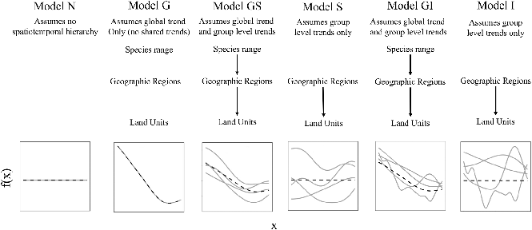

class: inverse middle center big-subsection

```{r setup, include=FALSE, cache=FALSE}
options(htmltools.dir.version = FALSE)
knitr::opts_chunk$set(cache = TRUE, dev = "svg", echo = TRUE, message = FALSE,
                      warning = FALSE,
                      fig.height = 6, fig.width = 1.777777 * 6)

library("gridGraphics")
library('here')
library('mgcv')
library('gratia')
library('ggplot2')
library('forcats')
library('purrr')
library('mvnfast')
library("tibble")
library('patchwork')
library('tidyr')
library("knitr")
library("viridis")
library('readr')
library('dplyr')
library('sf')

## plot defaults
theme_set(theme_bw(base_size = 16, base_family = 'Fira Sans'))

```

```{r xaringan-tile-view, echo = FALSE, eval = TRUE}
# If you don't have xaringanExtra or can't get it installed, just change
#   eval = TRUE above to eval = FALSE, you don't need it to use the slidedeck
#
# To install it, you ned the remotes pkg installed then run the next line
#   to install xaringanExtra from GitHUb
#
# remotes::install_github("gadenbuie/xaringanExtra")
#
# then this code chunk will work
xaringanExtra::use_tile_view()
```

# Day 4

???

---

# Logistics

## Slides

Slidedeck: [bit.ly/physalia-gam-4](https://bit.ly/physalia-gam-4)

Sources: [bit.ly/physalia-gam](https://bit.ly/physalia-gam)

Direct download a ZIP of everything: [bit.ly/physalia-gam-zip](https://bit.ly/physalia-gam-zip)

Unpack the zip & remember where you put it

---

# Matters arising

1. Credible intervals for smooths

2. *p* values for smooths

3. AIC

---
class: inverse center middle subsection

# Credible intervals for smooths

---

# Credible intervals for smooths

`plot.gam()` produces approximate 95% intervals (at +/- 2 SEs)

What do these intervals represent?

Nychka (1988) showed that standard Wahba/Silverman type Bayesian confidence intervals on smooths had good **across-the-function** frequentist coverage properties

When *averaged* over the range of covariate, 1 - &alpha; coverage is approximately 1 - &alpha;

---

# Credible intervals for smooths

.center[
```{r echo = FALSE, out.width = "90%"}
knitr::include_graphics("resources/miller-bayesian-gam-interpretation-fig.svg")
```
]

.smaller[
Miller (2021) Bayesian Views of Generalized Additive Modelling. [*arXiv*:1902.01330v3](http://arxiv.org/abs/1902.01330v3)
]

---

# Credible intervals for smooths

Marra & Wood (2012) extended this theory to the generalised case and explain where the coverage properties failed:

*Mustn't over-smooth too much, which happens when $\lambda_j$ are over-estimated*

Two situations where this might occur

1. where true effect is almost in the penalty null space, $\hat{\lambda}_j \rightarrow \infty$
	- ie. close to a linear function
2. where $\hat{\lambda}_j$ difficult to estimate due to highly correlated covariates
	- if 2 correlated covariates have different amounts of wiggliness, estimated effects can have degree of smoothness *reversed*

---

# Don't over-smooth

> In summary, we have shown that Bayesian componentwise variable width intervals... for the smooth components of an additive model **should achieve close to nominal *across-the-function* coverage probability**&hellip;

Basically

1. Don't over smooth, and

2. Effect of uncertainty due to estimating smoothness parameter is small

---

# Confidence intervals for smooths

Marra & Wood (2012) suggested a solution to situation 1., namely true functions close to the penalty null space.

Smooths are normally subject to *identifiability* constraints (centred), which leads to zero variance where the estimated function crosses the zero line.

Instead, compute intervals for $j$ th smooth as if it alone had the intercept; identifiability constraints go on the other smooth terms.

Use

* `seWithMean = TRUE` in call to `plot.gam()`
* `overall_uncertainty = TRUE` in call to `gratia::draw()`

---

# Example

```{r setup-confint-example, fig = TRUE, fig.width = 11, fig.height = 5.5, results = "hide", echo = FALSE}
library(mgcv)
set.seed(0)
## fake some data...
f1 <- function(x) {exp(2 * x)}
f2 <- function(x) { 
  0.2*x^11*(10*(1-x))^6+10*(10*x)^3*(1-x)^10 
}
f3 <- function(x) {x*0}

n<-200
sig2 <- 12
x0 <- rep(1:4,50)
x1 <- runif(n, 0, 1)
x2 <- runif(n, 0, 1)
x3 <- runif(n, 0, 1)
e <- rnorm(n, 0, sqrt(sig2))
y <- 2*x0 + f1(x1) + f2(x2) + f3(x3) + e
x0 <- factor(x0)

## fit and plot...
b <- gam(y ~ x0 + s(x1) + s(x2) + s(x3))

op <- par(mar = c(4,4,1,1) + 0.1)
layout(matrix(1:9, ncol = 3, byrow = TRUE))
curve(f1)
curve(f2)
curve(f3)
plot(b, shade=TRUE)
plot(b, shade = TRUE, seWithMean = TRUE) ## better coverage intervals
layout(1)
par(op)
```

---

# closer&hellip;

```{r draw-coverage-bands-closup, echo = FALSE}
f1_fun <- function(x) {
  y <- f1(x)
  y - mean(y)
}
p1 <- draw(b, select = c("s(x1)"), overall_uncertainty = FALSE) +
  labs(title = "s(x1): without uncertainty in constant") +
  geom_function(fun = f1_fun, colour = "red")
p2 <- draw(b, select = c("s(x1)")) +
  labs(title = "s(x1): with uncertainty in constant") +
  geom_function(fun = f1_fun, colour = "red")

p1 + p2 + plot_layout(ncol = 2)
```
---

# closer&hellip;

```{r draw-coverage-bands-closup-x3, echo = FALSE}
f3_fun <- function(x) {
  y <- f3(x)
  y - mean(y)
}
p1 <- draw(b, select = c("s(x3)"), overall_uncertainty = FALSE) +
  labs(title = "s(x3): without uncertainty in constant") +
  geom_function(fun = f3_fun, colour = "red")
p2 <- draw(b, select = c("s(x3)")) +
  labs(title = "s(x3): with uncertainty in constant") +
  geom_function(fun = f3_fun, colour = "red")

p1 + p2 + plot_layout(ncol = 2)
```

---

# Confidence intervals for smooths

Bands are a bayesian 95% credible interval on the smooth

`plot.gam()` draws the band at &plusmn; **2** std. err.

`gratia::draw()` draws them at $(1 - \alpha) / 2$ upper tail probability quantile of $\mathcal{N}(0,1)$

`gratia::draw()` draws them at ~ &plusmn;**1.96** std. err. & user can change $\alpha$ via argument `ci_level`

--

So `gratia::draw()` draws them at ~ &plusmn;**2** st.d err

---

# Across the function intervals

The *frequentist* coverage of the intervals is not pointwise &mdash; instead these credible intervals have approximately 95% coverage when *averaged* over the whole function

Some places will have more than 95% coverage, other places less

--

Assumptions yielding this result can fail, where estimated smooth is a straight line

--

Correct this with `seWithMean = TRUE` in `plot.gam()` or `overall_uncertainty = TRUE` in `gratia::draw()`

This essentially includes the uncertainty in the intercept in the uncertainty band

---

# Correcting for smoothness selection

The defaults assume that the smoothness parameter(s) $\lambda_j$ are *known* and *fixed*

--

But we estimated them

--

Can apply a correction for this extra uncertainty via argument `unconditional = TRUE` in both `plot.gam()` and `gratia::draw()`

---
class: inverse center middle subsection

# *p* values for smooths

---

# Example

```{r aic-models-setup, echo = FALSE}
n <- 200
dat <- data_sim("eg1", n = n, scale = .15, dist = "poisson", seed = 3)
set.seed(22)
dat <- dat %>% mutate(x4 = runif(n, 0, 1), x5 = runif(n, 0, 1),
                      f4 = rep(0, n), f5 = rep(0, n))   ## spurious
```

.row[
.col-5[

Data has a known unrelated effect & 2 spurious effects

.smaller[
```{r shrinkage-example-summary, results = "hide"}
m <- gam(y ~ s(x0) + s(x1) + s(x2) + s(x3) +
           s(x4) + s(x5),
         data = dat,
         method = "REML",
         select = TRUE)

summary(m) # ==>
```
]
]

.col-7[
.smaller[
```{r shrinkage-example-summary, echo = FALSE}
```
]
]
]

---

# *p* values for smooths

*p* values for smooths are approximate:

1. they don't account for the estimation of $\lambda_j$ &mdash; treated as known, hence *p* values are biased low

2. rely on asymptotic behaviour &mdash; they tend towards being right as sample size tends to $\infty$

---

# *p* values for smooths

...are a test of **zero-effect** of a smooth term

Default *p* values rely on theory of Nychka (1988) and Marra & Wood (2012) for confidence interval coverage

If the Bayesian CI have good across-the-function properties, Wood (2013a) showed that the *p* values have

- almost the correct null distribution

- reasonable power

Test statistic is a form of $\chi^2$ statistic, but with complicated degrees of freedom

---

# *p* values for fully penalized smooths

The results of Nychka (1988) and Marra & Wood (2012) break down if smooth terms have no unpenalized terms

This includes i.i.d. Gaussian random effects, (e.g. `bs = "re"`)

Wood (2013b) proposed instead a test based on a likelihood ratio statistic:

- the reference distribution used is appropriate for testing a $\mathrm{H}_0$ on the boundary of the allowed parameter space...

- ...in other words, it corrects for a $\mathrm{H}_0$ that a variance term is zero

---

# *p* values for smooths

Have the best behaviour when smoothness selection is done using **ML**, then **REML**.

Neither of these are the default, so remember to use `method = "ML"` or `method = "REML"` as appropriate

---

# AIC for GAMs

- Comparison of GAMs by a form of AIC is an alternative frequentist approach to model selection

- Rather than using the marginal likelihood, the likelihood of the $\mathbf{\beta}_j$ *conditional* upon $\lambda_j$ is used, with the EDF replacing $k$, the number of model parameters

- This *conditional* AIC tends to select complex models, especially those with random effects, as the EDF ignores that $\lambda_j$ are estimated

- Wood et al (2016) suggests a correction that accounts for uncertainty in $\lambda_j$

$$AIC = -2\mathcal{L}(\hat{\beta}) + 2\mathrm{tr}(\widehat{\mathcal{I}}V^{'}_{\beta})$$

---

# AIC for GAMs

```{r aic-models, dependson="aic-models-setup"}
b0 <- gam(y ~ s(x0) + s(x1) + s(x2),
          data = dat, family = poisson, method = "REML")
b1 <- gam(y ~ s(x0) + s(x1) + s(x2) + s(x3) + s(x4) + s(x5),
          data = dat, family = poisson, method = "REML", select = TRUE)
b2 <- gam(y ~ s(x0) + s(x1) + s(x2) + s(x3) + s(x4) + s(x5),
          data = dat, family = poisson, method = "REML")
```

---

# AIC

In this example, $x_3$, $x_4$, and $x_5$ have no effects on $y$

```{r aic-example, echo = TRUE, dependson = -1}
AIC(b0, b1, b2)
```

When there is *no difference* in compared models, accepts larger model ~16% of the time: consistent with probability AIC chooses a model with 1 extra spurious parameter $Pr(\chi^2_1 > 2)$

```{r aic-chisq, echo = TRUE}
pchisq(2, 1, lower.tail = FALSE)
```

---

# Today's topics

* Hierarchical GAMs (HGAMs)

    Introducing random smooths and how to model data with both group and individual smooth effects.

* Doing more with your models; introducing posterior simulation.

---

# Factor smooth interactions

Two ways for factor smooth interactions

1. `by` variable smooths
    * entirely separate smooth function for each level of the factor
	* each has it's own smoothness parameter
	* centred (no group means) so include factor as a fixed effect
	* `y ~ f + s(x, by = f)`
2. `bs = 'fs'` basis
    * smooth function for each level of the function
	* share a common smoothness parameter
	* fully penalized; include group means
	* closer to random effects
	* `y ~ s(x, f, bs = 'fs')`

---

# Random effects

When fitted with REML or ML, smooths can be viewed as just fancy random effects

Inverse is true too; random effects can be viewed as smooths

If you have simple random effects you can fit those in `gam()` and `bam()` without needing the more complex GAMM functions `gamm()` or `gamm4::gamm4()`

These two models are equivalent

```{r ranefs}
m_nlme <- lme(travel ~ 1, data = Rail, ~ 1 | Rail, method = "REML")

m_gam  <- gam(travel ~ s(Rail, bs = "re"), data = Rail, method = "REML")
```

---

# Random effects &mdash; Rails

Evaluation of Stress in Railway Rails. Data from Devore (2000) citing data on a study of travel time for a certain type of wave that results from longitudinal stress of rails used for railroad track.

```{r}
head(Rail)
```

.small[
Devore (2000) Probability and Statistics for Engineering and the Sciences (5th ed)
]

---

# Random effects &mdash; Rails

```{r}
m_nlme <- lme(travel ~ 1, data = Rail, ~ 1 | Rail, method = "REML")

m_gam  <- gam(travel ~ s(Rail, bs = "re", k = 2), data = Rail, method = "REML")

unlist(c(fixef(m_nlme), ranef(m_nlme)))
coef(m_gam)
```

---

# Variance components of smooths

.row[

.col-6[
```{r variance-comp-nlme}
m_nlme
```
]

.col-6[
```{r variance-comp-gam}
variance_comp(m_gam)
```
]
]

---

# Penalty matrix for a random effect

.row[

.col-7[
```{r re-basis, fig.show = "hide"}
pm <- penalty(m_gam, smooth = "s(Rail)")
draw(pm)
```

An identity matrix (1s on the diagonal)

Penalty shrinks estimated coefs towards 0, the overal mean of $\mathbf{y}$

Just like shrinkage in mixed effects model
]

.col-5[
```{r re-basis, echo = FALSE, dev = "png", dpi = 360, fig.align = "center", fig.width = 6.5, fig.height = 6}
```
]
]

---

# Random effects

The random effect basis `bs = 're'` is not as computationally efficient as *nlme* or *lme4* for fitting

* complex random effects terms, or
* random effects with many levels

Instead see `gamm()` and `gamm4::gamm4()`

* `gamm()` fits using `lme()`
* `gamm4::gamm4()` fits using `lmer()` or `glmer()`

For non Gaussian models use `gamm4::gamm4()`

---
class: inverse center middle subsection

# Example

---

# Rat hormone experiment

https://bit.ly/rat-hormone

Study on the effects of testosterone on the growth of rats (Molenberghs and Verbeke, 2000)

50 rats randomly assigned to 1 of 3 groups:

1. a control group
2. a group receiving low doses of Decapeptyl
3. a high Decapeptyl dose group

Decapeptyl inhibits the preoduction of testosterone

Experiment started (day 1) when rats were 45 days old and from day 50 the size of each rat's head was measured via an x-ray image

```{r setup-rat-hormone-example, echo = FALSE}
rats_url <- "https://bit.ly/rat-hormone"
rats <- read_table(rats_url, col_types = "dddddddddddd-")
# ignore the warning - it"s due to trailing white space at the ends of each
#   row in the file

rats <- rats %>%
    mutate(treatment = fct_recode(factor(group, levels = c(1, 2, 3)),
                                  Low = "1",
                                  High = "2",
                                  Control = "3"),
           treatment = fct_relevel(treatment, c("Control", "Low", "High")),
           subject = factor(subject))

plt_labs <- labs(y = "Head height (distance in pixels)",
                 x = "Age in days",
                 colour = "Treatment")

rat_plt <- ggplot(rats, aes(x = time, y = response,
                            group = subject, colour = treatment)) +
    geom_line() +
    facet_wrap(~ treatment, ncol = 3) +
    plt_labs
```

???

By way of an example, I'm going to use a data set from a study on the effects of testosterone on the growth of rats from Molenberghs and Verbeke (2000), which was analysed in Fahrmeir et al. (2013), from were I also obtained the data. In the experiment, 50 rats were randomly assigned to one of three groups; a control group or a group receiving low or high doses of Decapeptyl, which inhibits testosterone production. The experiment started when the rats were 45 days old and starting with the 50th day, the size of the rat's head was measured via an X-ray image. You can download the data.

---

# Rat hormone experiment

```{r plot-rat-data, echo = FALSE}
rat_plt
```

---

# Rat hormone experiment

To linearise the `time` variable, a transformation was applied

$$\mathtt{transf\_time} = \log (1 + (\mathtt{time} - 45) / 10)$$

The number of observations per rat is very variable

```{r obs-per-rat, echo = FALSE}
rats %>%
    na.omit() %>%
    count(subject) %>%
    count(n, name = "n_rats")
```

Only 22 of the 50 rats have the complete 7 measurements by day 110

---

# Rat hormone experiment

The model fitted in Fahrmeir *et al* (2013) is

$$y_{ij} = \alpha + \gamma_{0i} + \beta_1 L_i \cdot t_{ij} + \beta_2 H_i \cdot t_{ij} + \beta_3 C_i \cdot t_{ij} + \gamma_{1i} \cdot t_{ij} + \varepsilon_{ij}$$

where

* $\alpha$ is the population mean of the response at the start of the treatment
* $L_i$, $H_i$, $C_i$ are dummy variables coding for each treatment group
* $\gamma_{0i}$ is the rat-specific mean (random intercept)
* $\gamma_{qi} \cdot t_{ij}$ is the rat-specific effect of `transf_time` (random slope)

Code to fit this model in `lmer()` and `gam()` is in `day-4/rat-hormone-example.R`

???

If this isn't very clear --- it took me a little while to grok what this meant and translate it to R speak --- note that each of $\beta_1$, $\beta_2$, and $\beta_3$ are associated with an interaction between the dummy variable coding for the treatment and the time variable. So we have a model with an intercept and three interaction terms with no "main" effects.

---
class: inverse center middle subsection

# HGAMs

---

# Hierarchical models

The general term encompassing

* Random effects
* Mixed effects
* Mixed models
* &hellip;

Models are *hierarchical* because we have effects on the response at different scales

Data are grouped in some way

---

# Hierarchical GAMs

Hierarchical GAMs or HGAMs are what we (Pedersen et al 2019 *PeerJ*) called the marriage of

1. Hierarchical GLMs (aka GLMMs, aka Hierarchical models)
2. GAMs

Call them HGAMs if you want but these are really just *hierarchical models*

There's nothing special HGAMs once we've created the basis functions

---

# Hierarchical GAMs

Pedersen et al (2019) *PeerJ* described 6 models

```{r, fig.align = "center", out.width = "95%", echo = FALSE}

```

.small[Source: [Lawton *et al* (2022) *Ecography*](http://doi.org/10.1111/ecog.05763) modified from [Pedersen *et al* (2019) *PeerJ*](http://doi.org/10.7717/peerj.6876)]

---

# Global effects

What we called *global effects* or *global trends* are a bit like population-level effects in mixed-model speak

They aren't quite, but they are pretty close to the average smooth effect over all the data

Really these are *group-level effects* or *group-level effects* where data has multiple levels

1. "population", top level grouping (i.e. everything)
2. treatment level,
3. etc

---

# Subject-specific effects

Within these groups we have *subject-specific effects* &mdash; which could be smooth

Repeated observations on a set of subjects over time say

Those subjects may be within groups (treatment groups say)

We may or may not have group-level (*global*; treatment) effects

---

# Hierarchical GAMs

These models are just different ways to decompose the data

If there are common (non-linear) effects that explain variation for all subjects in a group it may be more parsimonious to

* model those common effects plus subject-specific differences, instead of

* modelling each subject-specific response individually

---
class: inverse center middle subsection

# Posterior prediction

---

# 🐡🐠🐟🦐 Species richness & 🦐 biomass

The example comes from trawl data from off the coast of Newfoundland and Labrador, Canada

* Counts of species richness at each trawl location
* Shrimp biomass at each trawl location
* Annual trawls 2005&ndash;2014

---

# 🐡🐠🐟🦐 Species richness

.row[
.col-6[
```{r load-shrimp}
shrimp <- read.csv(here("data", "trawl_nl.csv"))
```

```{r shrimp-richness}
m_rich <- gam(richness ~ s(year),
              family = poisson,
              method = "REML",
              data = shrimp)
```
]
.col-6[
```{r richness-violin, fig.height=5, fig.width=5, echo=FALSE}
ggplot(shrimp) +
  geom_violin(aes(x = richness, y = factor(year))) +
    labs(x = "Number of species", y = "Year")
```
]
]

---

# 🐡🐠🐟🦐 Species richness

```{r draw-richness-gam, out.width = "90%", fig.align = "center"}
draw(m_rich)
```

---

# Spatio-temporal data

🦐 biomass at each trawl

```{r biom-space-time-plot, fig.height=8, fig.width=15, echo=FALSE, dev="png", dpi = 300}
library('sf')
coast <- read_sf(here("data", "nl_coast.shp"))
ggplot(shrimp) +
  geom_point(aes(x = long, y = lat, size = shrimp), alpha = 0.5) +
  geom_sf(data = coast) +
  facet_wrap(~year, ncol = 5)
```
---

# Spatio-temporal model

```{r fit-shrimp-space-time}
m_spt <- gam(shrimp ~ te(x, y, year, d = c(2,1),
                         bs = c('tp', 'cr'), k = c(20, 5)),
             data = shrimp,
             family = tw(),
             method = "REML")
```

---

# Predicting with `predict()`

`plot.gam()` and `gratia::draw()` show the component functions of the model on the link scale

Prediction allows us to evaluate the model at known values of covariates on the response scale

Use the standard function `predict()`

Provide `newdata` with a data frame of values of covariates

---

# `predict()`

```{r predict-newdata}
new_year <- with(shrimp, tibble(year = seq(min(year), max(year), length.out = 100)))
pred <- predict(m_rich, newdata = new_year, se.fit = TRUE, type = 'link')
pred <- bind_cols(new_year, as_tibble(as.data.frame(pred)))
pred
```

---

# `predict()` &rarr; response scale

```{r predict-newdata-resp}
ilink <- inv_link(m_rich)                         # inverse link function
crit <- qnorm((1 - 0.89) / 2, lower.tail = FALSE) # or just `crit <- 2`
pred <- mutate(pred, richness = ilink(fit),
               lwr = ilink(fit - (crit * se.fit)), # lower...
               upr = ilink(fit + (crit * se.fit))) # upper credible interval
pred
```

---

# `predict()` &rarr; plot

Tidy objects like this are easy to plot with `ggplot()`

```{r plot-predictions-richness, fig.height = 4}
ggplot(pred, aes(x = year)) +
    geom_ribbon(aes(ymin = lwr, ymax = upr), alpha = 0.2) +
    geom_line(aes(y = richness)) + labs(y = "Species richness", x = NULL)
```

---

# `predict()` for space and time

This idea is very general;  spatiotemporal model needs a grid of x,y coordinates for each year

```{r spt-example-predict}
sp_new <- with(shrimp, expand.grid(x = evenly(x, n = 100), y = evenly(y, n = 100),
                                   year = unique(year)))
sp_pred <- predict(m_spt, newdata = sp_new, se.fit = TRUE) # link scale is default
sp_pred <- bind_cols(as_tibble(sp_new), as_tibble(as.data.frame(sp_pred)))
sp_pred
```

---

# `predict()` &rarr; response scale

```{r spt-example-response-scale}
ilink <- inv_link(m_spt)
too_far <- exclude.too.far(sp_pred$x, sp_pred$y, shrimp$x, shrimp$y, dist = 0.1)
sp_pred <- sp_pred %>% mutate(biomass = ilink(fit),
                              biomass = case_when(too_far ~ NA_real_,
                                                  TRUE ~ biomass))
sp_pred
```

---

# `predict()` &rarr; plot

```{r spt-example-plot, fig.height = 5.5, dev="png", dpi = 300}
ggplot(sp_pred, aes(x = x, y = y, fill = biomass)) + geom_raster() +
    scale_fill_viridis_c(option = "plasma") + facet_wrap(~ year, ncol = 5) + coord_equal()
```

---

# Visualizing the trend?

We have this model

.smaller[
```{r show-m-spt}
m_spt
```
]

How would you visualize the average change in biomass over time?

---

# Welcome back old friend

One way is to  decompose the spatio-temporal function in main effects plus interaction

```{r shrimp-ti-model}
m_ti <- gam(shrimp ~ ti(x, y, year, d = c(2, 1), bs = c("tp", "cr"), k = c(20, 5)) +
                s(x, y, bs = "tp", k = 20) +
                s(year, bs = "cr", k = 5),
            data = shrimp, family = tw, method = "REML")
```

and predict from the model using only the marginal effect of `s(year)`

---

# `predict()` with `exclude`

.row[
.col-6[
We can exclude the spatial & spatiotemporal terms from predictions using `exclude`

**Step 1** run `gratia::smooths()` on model & note the names of the smooth you *don't* want &rarr;
]
.col-6[
.smaller[
```{r summary-spt-ti}
smooths(m_ti)
```
]
]
]

---

# `predict()` with `exclude` &mdash; Step 2 *predict*

Prediction data only need dummy values for `x` and `y`

```{r pred-data-ti-model}
ti_new <- with(shrimp, expand.grid(x = mean(x), y = mean(y), year = evenly(year, n = 100)))

ti_pred <- predict(m_ti, newdata = ti_new, se.fit = TRUE,
                   exclude = c("ti(x,y,year)", "s(x,y)")) #<<

ti_pred <- bind_cols(as_tibble(ti_new), as_tibble(as.data.frame(ti_pred))) %>%
    mutate(biomass = ilink(fit),
           lwr = ilink(fit - (crit * se.fit)),
           upr = ilink(fit + (crit * se.fit)))
```

`exclude` takes a character vector of terms to exclude &mdash; `predict()` sets the contributions of those terms to 0

Could also use `terms = "s(year)"` to select only the named smooths

```{r pred-data-ti-model-terms, results = "hide"}
predict(m_ti, newdata = ti_new, se.fit = TRUE, terms = "s(year)")
```

---

# `predict()` with `exclude`&mdash; Step 3 *plot it!*

```{r plot-ti-marginal-trend, fig.height = 5}
ggplot(ti_pred, aes(x = year)) + geom_ribbon(aes(ymin = lwr, ymax = upr), alpha = 0.3) +
    geom_line(aes(y = biomass)) + labs(y = "Biomass", x = NULL)
```

---

# Using `fitted_values()`

```{r predict-via-fitted-values, out.width = "70%", fig.align = "center"}
ti_pred2 <- fitted_values(m_ti, data = ti_new,
                          scale = "response",
                          exclude = c("ti(x,y,year)", "s(x,y)")) #<<

ggplot(ti_pred2, aes(x = year)) + geom_ribbon(aes(ymin = lower, ymax = upper), alpha = 0.3) +
  geom_line(aes(y = fitted)) + labs(y = "Biomass", x = NULL)
```

---
class: inverse middle center subsection

# Posterior simulation

---

# Remember this?

.center[
```{r echo = FALSE, out.width = "80%"}
knitr::include_graphics("resources/miller-bayesian-gam-interpretation-fig.svg")
```
]

.smaller[
Miller (2021) Bayesian Views of Generalized Additive Modelling. [*arXiv*:1902.01330v3](http://arxiv.org/abs/1902.01330v3)
]

--

Where did the faint grey lines come from?

---

# Posterior distributions

Each line is a draw from the *posterior distribution* of the smooth

Remember the coefficients for each basis function?: $\beta_j$

Together they are distributed *multivariate normal* with

* mean vector given by $\hat{\beta}_j$
* covariance matrix $\boldsymbol{\hat{V}}_{\beta}$

$$\text{MVN}(\boldsymbol{\hat{\beta}}, \boldsymbol{\hat{V}}_{\beta})$$

--

The model as a whole has a posterior distribution too

--

We can simulate data from the model by taking draws from the posterior distribution

---

# Posterior simulation for a smooth

Sounds fancy but it's only just slightly more complicated than using `rnorm()`

To do this we need a few things:

1. The vector of model parameters for the smooth, $\boldsymbol{\hat{\beta}}$
2. The covariance matrix of those parameters, $\boldsymbol{\hat{V}}_{\beta}$
3. A matrix $\boldsymbol{X}_p$ that maps parameters to the linear predictor for the smooth

$$\boldsymbol{\hat{\eta}}_p = \boldsymbol{X}_p \boldsymbol{\hat{\beta}}$$

--

Let's do this for `m_rich`

---

# Posterior sim for a smooth &mdash; step 1

The vector of model parameters for the smooth, $\boldsymbol{\hat{\beta}}$

```{r richness-coefs}
sm_year <- get_smooth(m_rich, "s(year)") # extract the smooth object from model
idx <- gratia:::smooth_coef_indices(sm_year) # indices of the coefs for this smooth
idx

beta <- coef(m_rich)                     # vector of model parameters
beta[idx]                                # coefs for this smooth
```

---

# Posterior sim for a smooth &mdash; step 2

The covariance matrix of the model parameters, $\boldsymbol{\hat{V}}_{\beta}$

```{r richness-vcov, results = "hide", dependson=-1}
Vb <- vcov(m_rich) # default is the bayesian covariance matrix
Vb
```

.small[
```{r richness-vcov-print, echo = FALSE, dependson=-1}
op <- options(width = 170)
Vb
options(op)
```
]

---

# Posterior sim for a smooth &mdash; step 3

A matrix $\boldsymbol{X}_p$ that maps parameters to the linear predictor for the smooth

We get $\boldsymbol{X}_p$ using the `predict()` method with `type = "lpmatrix"`

```{r richness-xp-matrix, dependson=-1}
new_year <- with(shrimp, tibble(year = evenly(year, n = 100)))
Xp <- predict(m_rich, newdata = new_year, type = 'lpmatrix')
dim(Xp)
```

---

# Posterior sim for a smooth &mdash; step 4

Take only the columns of $\boldsymbol{X}_p$ that are involved in the smooth of `year`

```{r richness-reduce-xp, dependson=-1}
Xp <- Xp[, idx, drop = FALSE]
dim(Xp)
```

---

# Posterior sim for a smooth &mdash; step 5

Simulate parameters from the posterior distribution of the smooth of `year`

```{r richness-simulate-params, dependson=-1}
set.seed(42)
beta_sim <- rmvn(n = 20, beta[idx], Vb[idx, idx, drop = FALSE])
dim(beta_sim)
```

Simulating many sets (20) of new model parameters from the estimated parameters and their uncertainty (covariance)

Result is a matrix where each row is a set of new model parameters, each consistent with the fitted smooth

---

# Posterior sim for a smooth &mdash; step 6

.row[
.col-6[
Form $\boldsymbol{\hat{\eta}}_p$, the posterior draws for the smooth

```{r richness-posterior-draws, fig.height = 5, fig.show = 'hide', dependson=-1}
sm_draws <- Xp %*% t(beta_sim)
dim(sm_draws)
matplot(sm_draws, type = 'l')
```

A bit of rearranging is needed to plot with `ggplot()`
]

.col-6[
```{r richness-posterior-draws, fig.height = 5, fig.width = 5, echo = FALSE, results = 'hide'}
```
]

]

--

Or use `smooth_samples()`

---

# Posterior sim for a smooth &mdash; steps 1&ndash;6

```{r plot-posterior-smooths, fig.height = 5, dependson=-1}
sm_post <- smooth_samples(m_rich, 's(year)', n = 20, seed = 42)
draw(sm_post)
```

---

# Posterior simulation from the model

Simulating from the posterior distribution of the model requires 1 modification of the recipe for a smooth and one extra step

We want to simulate new values for all the parameters in the model, not just the ones involved in a particular smooth

--

Additionally, we could simulate *new response data* from the model and the simulated parameters (**not shown** below)

---

# Posterior simulation from the model

```{r posterior-sim-model, dependson=-1}
beta <- coef(m_rich)   # vector of model parameters
Vb <- vcov(m_rich)     # default is the bayesian covariance matrix
Xp <- predict(m_rich, type = 'lpmatrix')
set.seed(42)
beta_sim <- rmvn(n = 1000, beta, Vb) # simulate parameters
eta_p <- Xp %*% t(beta_sim)        # form linear predictor values
mu_p <- inv_link(m_rich)(eta_p)    # apply inverse link function

mean(mu_p[1, ]) # mean of posterior for the first observation in the data
quantile(mu_p[1, ], probs = c(0.025, 0.975))
```

---

# Posterior simulation from the model

```{r posterior-sim-model-hist, fig.height = 5, dependson=-1}
ggplot(tibble(richness = mu_p[587, ]), aes(x = richness)) +
    geom_histogram() + labs(title = "Posterior richness for obs #587")
```

---

# Posterior simulation from the model

Or easier using `fitted_samples()`

```{r richness-fitted-samples, fig.height = 4.5, dependson=-1}
rich_post <- fitted_samples(m_rich, n = 1000, newdata = shrimp, seed = 42)
ggplot(filter(rich_post, row == 587), aes(x = fitted)) +
    geom_histogram() + labs(title = "Posterior richness for obs #587", x = "Richness")
```

---

# Why is this of interest?

Say you wanted to get an estimate for the total biomass of shrimp over the entire region of the trawl survey for 2007

You could predict for the spatial grid for `year == 2007` using code shown previously and sum the predicted biomass values over all the grid cells

--

**Easy**

--

But what if you also wanted the uncertainty in that estimate?

--

**Hard**

--

**Math** 😱😱 "something, something, delta method, something" 😱😱

---

# Posterior simulation makes this easy

1. Take a draw from the posterior distribution of the model
2. Use the posterior draw to predict biomass for each grid cell
3. Sum the predicted biomass values over all grid cells
4. Store the total biomass value
5. Repeat 1&ndash;4 a lot of times to get posterior distribution for total biomass
6. Summarize the total biomass posterior
    * Estimated total biomass is the mean of the total biomass posterior
	* Uncertainty is some lower/upper tail probability quantiles of the posterior

---

# Let's do it

```{r total-biomass-posterior-1, dependson=-1}
sp_new <- with(shrimp, expand.grid(x = evenly(x, n = 100), y = evenly(y, n = 100),
                                   year = 2007))
Xp <- predict(m_spt, newdata = sp_new, type = "lpmatrix")

## work out now which points are too far now
too_far <- exclude.too.far(sp_new$x, sp_new$y, shrimp$x, shrimp$y, dist = 0.1)

beta <- coef(m_spt)                  # vector of model parameters
Vb <- vcov(m_spt)                    # default is the bayesian covariance matrix
set.seed(42)
beta_sim <- rmvn(n = 1000, beta, Vb) # simulate parameters
eta_p <- Xp %*% t(beta_sim)          # form linear predictor values
mu_p <- inv_link(m_spt)(eta_p)       # apply inverse link function
```

Columns of `mu_p` contain the expected or mean biomass for each grid cell per area trawled

Sum the columns of `mu_p` and summarize

---

# Summarize the expected biomass

```{r total-biomass-posterior-2, dependson = -1}
mu_copy <- mu_p              # copy mu_p
mu_copy[too_far, ] <- NA     # set cells too far from data to be NA
total_biomass <- colSums(mu_copy, na.rm = TRUE)  # total biomass over the region

mean(total_biomass)
quantile(total_biomass, probs = c(0.025, 0.975))
```

---

# Summarize the expected biomass

```{r total-biomass-histogram, echo = FALSE, dependson=-1}
ggplot(tibble(biomass = total_biomass), aes(x = biomass)) +
    geom_histogram()
```

---

# With `fitted_samples()`

.row[

.col-7[
```{r biomass-fitted-samples-example, dependson=-1}
bio_post <- fitted_samples(m_spt, n = 1000,
                           newdata = sp_new[!too_far, ],
                           seed = 42) %>%
    group_by(draw) %>%
    summarise(total = sum(fitted),
              .groups = "drop_last")

with(bio_post, mean(total))
with(bio_post, quantile(total, probs = c(0.025, 0.975)))
```
]

.col-5[
```{r biomass-fitted-samples-plot, fig.width = 5, fig.height = 5, dependson=-1}
ggplot(bio_post, aes(x = total)) +
    geom_histogram() +
    labs(x = "Total biomass")
```

]

]

---
class: inverse middle center subsection

# Example

---

# Max species abundance

We have measurements of the abundance of a particular species along an environmental gradient

```{r}
spp_url <- "https://bit.ly/spp-gradient"
gradient <- read_csv(spp_url, col_types = "dd")
gradient
```

---

# Max species abundance

Tasks

1. fit a suitable GAM (the data are counts)

2. estimate the value of the environmental gradient where the species reaches its maximal abundance and use *posterior simulation* to provide an uncertainty estimate for this value

---

# Addendum

We used a *Gaussian approximation* to the model posterior distribution

This works well for many models but it's an approximation and can fail when the posterior is far from Gaussian

Other options include

1. using integrated nested Laplace approximation `mgcv::ginla()`
2. using a Metropolis Hastings sampler `mgcv::gam.mh()`

See `?mgcv::gam.mh` for an example where Gaussian approximation fails badly

--

`fitted_samples()`, `smooth_samples()` etc only do Gaussian approximation *currently*

---

# Next steps

Read Simon Wood's book!

Lots more material on our ESA GAM Workshop site

[https://noamross.github.io/mgcv-esa-workshop/]()

Noam Ross' free GAM Course <https://noamross.github.io/gams-in-r-course/>

Noam also maintains a list of [GAM Resources](https://github.com/noamross/gam-resources)

A couple of papers:

.smaller[
1. Simpson, G.L., 2018. Modelling Palaeoecological Time Series Using Generalised Additive Models. Frontiers in Ecology and Evolution 6, 149. https://doi.org/10.3389/fevo.2018.00149
2. Pedersen, E.J., Miller, D.L., Simpson, G.L., Ross, N., 2019. Hierarchical generalized additive models in ecology: an introduction with mgcv. PeerJ 7, e6876. https://doi.org/10.7717/peerj.6876
]

Also see my blog: [fromthebottomoftheheap.net](http://fromthebottomoftheheap.net)

---

# Reuse

* HTML Slide deck [bit.ly/physalia-gam-4](https://bit.ly/physalia-gam-4) &copy; Simpson (2020-2022) [](http://creativecommons.org/licenses/by/4.0/)
* RMarkdown [Source](https://bit.ly/physalia-gam)

---

# References

- [Marra & Wood (2011) *Computational Statistics and Data Analysis* **55** 2372&ndash;2387.](http://doi.org/10.1016/j.csda.2011.02.004)
- [Marra & Wood (2012) *Scandinavian Journal of Statistics, Theory and Applications* **39**(1), 53&ndash;74.](http://doi.org/10.1111/j.1467-9469.2011.00760.x.)
- [Nychka (1988) *Journal of the American Statistical Association* **83**(404) 1134&ndash;1143.](http://doi.org/10.1080/01621459.1988.10478711)
- Wood (2017) *Generalized Additive Models: An Introduction with R*. Chapman and Hall/CRC. (2nd Edition)
- [Wood (2013a) *Biometrika* **100**(1) 221&ndash;228.](http://doi.org/10.1093/biomet/ass048)
- [Wood (2013b) *Biometrika* **100**(4) 1005&ndash;1010.](http://doi.org/10.1093/biomet/ast038)
- [Wood et al (2016) *JASA* **111** 1548&ndash;1563](https://doi.org/10.1080/01621459.2016.1180986)
