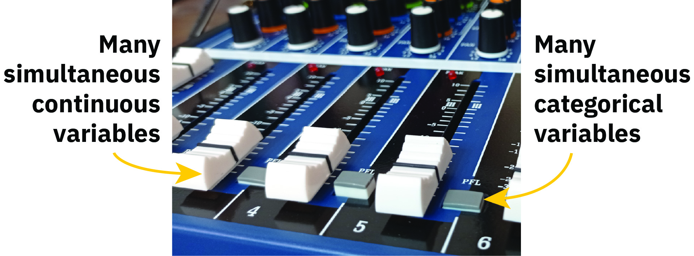

class: inverse middle center big-subsection

```{r setup, include=FALSE, cache=FALSE}
options(htmltools.dir.version = FALSE)
knitr::opts_chunk$set(cache = FALSE, dev = "svg", echo = TRUE, message = FALSE,
                      warning = FALSE,
                      fig.height = 6, fig.width = 1.777777 * 6)

library("gridGraphics")
library("here")
library("mgcv")
library("qgam")
library("gratia")
library("ggplot2")
library("forcats")
library("purrr")
library("mvnfast")
library("tibble")
library("patchwork")
library("tidyr")
library("knitr")
library("viridis")
library("readr")
library("dplyr")
library("sf")
library("gglm")

## plot defaults
theme_set(theme_bw(base_size = 16, base_family = "Fira Sans"))

```

```{r xaringan-tile-view, echo = FALSE, eval = TRUE}
# If you don't have xaringanExtra or can't get it installed, just change
#   eval = TRUE above to eval = FALSE, you don't need it to use the slidedeck
#
# To install it, you ned the remotes pkg installed then run the next line
#   to install xaringanExtra from GitHUb
#
# remotes::install_github("gadenbuie/xaringanExtra")
#
# then this code chunk will work
xaringanExtra::use_tile_view()
```

# Day 5

???

---

# Logistics

## Slides

Slidedeck: [bit.ly/physalia-gam-5](https://bit.ly/physalia-gam-5)

Sources: [bit.ly/physalia-gam](https://bit.ly/physalia-gam)

Direct download a ZIP of everything: [bit.ly/physalia-gam-zip](https://bit.ly/physalia-gam-zip)

Unpack the zip & remember where you put it

---
class: inverse center middle subsection

# Time series

---

# Smoothing autocorrelated data

Smoothing temporally autocorrelated data can `-->` over fitting

.row[

.col-6[

$y$ is contaminated with AR(1) noise

.smaller[
```{r correlated-data-eg, fig.show = "hide"}
set.seed(321)
n <- 100
time <- 1:n
xt <- time/n
Y <- (1280 * xt^4) * (1- xt)^4
y <- as.numeric(Y + arima.sim(list(ar = 0.3713),
                              n = n))
df <- tibble(y = y, time = time, f = Y)

# plot
plt <- ggplot(df, aes(x = time, y = y)) +
  geom_point() +
  geom_line(aes(y = f),
            col = "steelblue", lwd = 2)
plt
```
]
]

.col-6[
```{r correlated-data-eg, echo = FALSE, fig.width = 6, fig.height = 6}
```
]
]

---

# Smoothing autocorrelated data

.row[

.col-6[
.smaller[
```{r fit-correlated-data-eg, fig.show = "hide"}
# standard fit
m_reml <- gam(y ~ s(time, k = 20), data = df,
              method = "REML")
# use GCV
m_gcv <- gam(y ~ s(time, k = 20), data = df)

# fitted values
fv_reml <- fitted_values(m_reml)
fv_gcv <- fitted_values(m_gcv)

# plot
plt + geom_line(data = fv_reml,
               aes(x = time, y = .fitted),
               col = "red") +
  geom_line(data = fv_gcv,
            aes(x = time, y = .fitted),
            col = "darkgreen")
```
]
]

.col-6[

```{r fit-correlated-data-eg, echo = FALSE, fig.width = 6, fig.height = 6}
```
]
]

---

# Smoothing autocorrelated data

What about smoothing where $x$ is time? Is this still a problem?

--

Yes *and* No

--

Depends on how you want to decompose *time* again

---

# Temporal dependence

Temporal dependence really means that observations that are close together in time tend to be similar to one another than observations well separated in time

How similar depends on the memory length of the system

--

Strong dependence &mdash; high autocorrelatation &,dash; long memory

Weak dependence &mdash; low autocorrelatation &,dash; short memory

---

# Temporal dependence

What does a GAM say about our data?

--

It says that observations near to one another (in covariate space) are more similar than observations further apart

---

# Temporal dependence & GAMs

From this perspective then

Wiggly smooths = Strong dependence

Smooth (!) smooths = Weak dependence

---

# Temporal dependence & GAMs

If you don't like your trend to be that wiggly, what to do?

--

You could decompose the temporal effect into a smooth trend *plus* an autocorrelated process in the $\varepsilon$

--

That process could be ARMA(*p*, *q*) or a continuous time AR(1)

--

Fit with `gamm()` using `correlation` argument, or `bam()` (AR(1) only)

---

# Smoothing autocorrelated data &mdash; `gamm()`

.row[

.col-6[
.smaller[
```{r fit-correlated-data-gamm, fig.show = "hide"}
# standard fit
m_ar1 <- gamm(y ~ s(time, k = 20), data = df,
              correlation = corAR1(form = ~ 1), #<--
              method = "REML")

# fitted values
fv_ar1 <- fitted_values(m_ar1$gam)

# plot
gamm_plt <- plt +
  geom_ribbon(data = fv_ar1,
    aes(ymin = .lower_ci, ymax = .upper_ci,
      y = NULL),
    alpha = 0.2, fill = "hotpink") +
  geom_line(data = fv_ar1,
    aes(x = time, y = .fitted),
    col = "hotpink", lwd = 1.5)
gamm_plt
```
]
]

.col-6[

```{r fit-correlated-data-gamm, echo = FALSE, fig.width = 6, fig.height = 6}
```
]
]

---

# Smoothing autocorrelated data &mdash; `bam()`

Estimate an AR(1) term in the covariance with `bam()`

Provide a value of $\rho$ (`rho`) &mdash; use (P)ACF

```{r fit-correlated-data-bam-0}
m <- bam(y ~ s(time, k = 10), data = df, method = "fREML")
```
.row[

.col-6[

ACF

```{r bam-acf}
acf(resid(m))
```
]

.col-6[

Partial ACF

```{r bam-pacf}
pacf(resid(m))
```
]

]

---

# Smoothing autocorrelated data &mdash; `bam()`

Use estimate of $\rho$, say `rho = 0.35`

```{r fit-correlated-data-bam-1, fig.show = "hide"}
# standard fit
b_ar1 <- bam(
  y ~ s(time, k = 20), data = df,
  rho = 0.35, #<--
  method = "fREML"
)

```

---

# Smoothing autocorrelated data &mdash; `bam()`

.row[

.col-6[
```{r fit-correlated-data-bam-plot, fig.show = "hide"}
# fitted values
fv_bar1 <- fitted_values(b_ar1)

# plot
bar1_plt <- plt +
  geom_ribbon(data = fv_bar1,
    aes(ymin = .lower_ci, ymax = .upper_ci,
      y = NULL),
    alpha = 0.2, fill = "hotpink") +
  geom_line(data = fv_bar1,
    aes(x = time, y = .fitted),
    col = "hotpink", lwd = 1.5)
bar1_plt
```
]
.col-6[

```{r fit-correlated-data-bam-plot, echo = FALSE, fig.width = 6, fig.height = 6}
```
]
]

---

# Compare the fits

```{r autocorrel-compare-fits-plots, fig.align = "center", echo = FALSE}
(gamm_plt + ggtitle("GAMM")) + (bar1_plt + ggtitle("BAM"))
```

---

# Compare fits

```{r}
model_edf(m_ar1, b_ar1)

## GAMM AR(1) rho
nlme::intervals(m_ar1$lme, which = "var-cov")$corStruct
```

---

# Irregularly spaced data

Intervals between observation are irregular? Things get much harder

Two main options

1. Fit a continuous time AR(1) (CAR(1)) using `gamm()` &mdash; `correlation = corCAR1(form ~ 1)`

2. Fit a 1-D spatial correlation function using `gamm()` &mdash; `correlation = corExp(form ~ time)`

3. Or use *brms* or *glmmTMB*

4. Consider *mvgam* &mdash; but the trend is a stochastic process, not a smooth

---

# But&hellip;

This can only work if the trend and the autocorrelation process are separately identifiable from the data

Or you are willing to impose constraints on one of

* the smooth of time (using a low `k`), or

* specify the parameters of the autocorrelation process

See [Simpson (2018)](https://doi.org/10.3389/fevo.2018.00149) for a brief discussion on this plus examples & the cited references therein

---

# Non-normal data?

What if you have non-Gaussian data?

* `bam()` & AR(1) &mdash; GEE-like approach, working correlation matrix

* `gamm()` & `correlation` &mdash; fits via `MASS::glmmPQL()`, works it **hard** --> fitting problems are common, plus PQL is bad for count data with low means

* `brms::brm()` &mdash; Bayesian so you have to work harder, no CAR(1), but has spatial correlation functions

* `mvgam` &mdash; Bayesian so *ditto*, the trend is a stochastic process, not a smooth

---

# Or use Neighbourhood CV

.row[

.col-9[

New smoothness selection method

`method = "NCV"`

Not super user friendly

Basically, for _each_ observation in the data, we specify

1. the neighbourhood of samples to use for estimating $\lambda_j$, and
2. the neighbourhood of samples to use for out-of-sample prediction

This gets tricky to do easily for complex settings

]

.col-3[

```{r danger-will-robinson, fig.align = "center", echo = FALSE}

```

.smaller[
([Linda Essig](https://creativeinfrastructure.org/2013/01/19/danger-will-robinson/))
]

]

] 

---

# NCV

We need to define two things: `k`, the indices of observations to drop for each neighbourhood, and `m`, the end points of each neighbourhood

Plus their counterparts for prediction neighbourhoods: `i` and `mi`

.row[

.col-6[
```{r setup-nei}
nei <- list()
start <- pmax(1, (1:100) - 5)
end <- pmin(100, (0:99) + 5)
nt <- lapply(1:100, \(x) start[x]:end[x])
nei$k <- unlist(nt)
nei$m <- cumsum(lapply(nt, length))
nei$i <- nei$k
nei$mi <- nei$m
```

]

.col-6[

```{r ncv-vis-nei, fig.align = "center"}
mgcvUtils::vis_nei(nei)
```
]
]

.smaller[
  Code modified from https://calgary.converged.yt/articles/ncv_timeseries.html
]

---

# NCV model fitting


.row[

.col-6[
```{r ncv-fitted-plot}
m_ncv <- gam(y ~ s(time, k = 20),
  data = df, method = "NCV",
  nei = nei)

fv_ncv <- fitted_values(m_ncv)
ncv_plt <- plt +
  geom_ribbon(data = fv_ncv,
    aes(ymin = .lower_ci, ymax = .upper_ci,
      y = NULL),
    alpha = 0.2, fill = "hotpink") +
  geom_line(data = fv_ncv,
    aes(x = time, y = .fitted),
    col = "hotpink", lwd = 1.5)
ncv_plt
```
]

.col-6[
```{r ncv-fitted-plot, fig.align = "center", echo = FALSE}
```
]
]

---

# Compare

```{r compare-all-methods, fig.align = "center", echo = FALSE, fig.height = 4, out.width = "98%"}
(gamm_plt + ggtitle("GAMM")) +
  (bar1_plt + ggtitle("BAM")) +
  (ncv_plt + ggtitle("NCV")) + plot_layout(ncol = 3, nrow = 1)
```

---

# NCV

NCV shows huge promise

Pain in the butt to setup

No R tooling to do the setup for you

Read more about it in Simon's preprint [Wood (2024)](https://doi.org/10.48550/arXiv.2404.16490) and Dave Miller's Yes! [You can do that in mgcv](https://calgary.converged.yt/) site

Focus with NCV is in estimating the smooths in the presence of local dependence

I have no idea what it does to the interpretation of credible intervals or *p* values as the data aren't conditionally independent

---
class: inverse center middle subsection

# Prediction intervals

---

# Prediction intervals

One use for posterior simulation is to generate prediction intervals for a fitted model

Prediction intervals include two sources of uncertainty

1. that from the estimated model itself, plus

2. the sampling uncertainty or error that arises from drawing observations from the conditional distribution of the response

---

# Prediction intervals

As an example, we'll use simulated data from Gu & Wabha's $f_2$ test function

```{r pint-sim-data, echo = FALSE, fig.align = "center"}
df <- data_sim("gwf2", n = 400, scale = 1, dist = "normal", seed = 8)
df |>
  ggplot(aes(x = x, y = y)) +
  geom_point() +
  geom_function(fun = gw_f2, colour = "#0072B2", linewidth = 1.5)
```

---

# Prediction intervals

Fit a Gaussian GAM as I simulated Gaussian data

```{r pint-fit-model}
m <- gam(y ~ s(x), data = df, method = "REML", family = gaussian())
```

.small[
The idea described in the next few slides works for any distribution, but in practice it depends on whether the distribution has a built-in RNG function or for specialist families that return non-standard responses (e.g. `ocat()`, `multinom()`, `mvn()`) whether the infrastructure in *gratia* has been written to handle those familes [Ed: it hasn't, yet]
]

---

# Prediction intervals

In this model, we have two sources of uncertainty

1. the uncertainty in $\hat{\boldsymbol{\beta}}$ and $\hat{\boldsymbol{\lambda}}$

2. the stochastic nature of the data as random draws from $y_i \sim \mathcal{D}(\mu_i, \phi)$

---

# Prediction intervals

Uncertainty in $\hat{\boldsymbol{\beta}}$ and $\hat{\boldsymbol{\lambda}}$ is what we see in the credible interval around the fitted smooth (response)

```{r pint-fitted-model, echo = FALSE, fig.align = "center"}
m |> conditional_values(condition = "x", unconditional = TRUE) |>
  draw() + geom_point(data = df, aes(x = x, y = y))
```

---

# Prediction intervals

Also what we see when we take posterior draws using `fitted_samples()`

```{r pint-fitted-model-with-fs, echo = FALSE, fig.align = "center"}
ds <- data_slice(m, x = evenly(x, n = 200)) |>
  mutate(.row = row_number())
fs <- fitted_samples(m, n = 50, data = ds, seed = 24, unconditional = TRUE) |>
  left_join(ds)
m |> conditional_values(condition = "x", unconditional = TRUE) |>
  draw() + geom_point(data = df, aes(x = x, y = y)) +
  geom_line(data = fs, aes(x = x, y = .fitted, group = .draw), alpha = 0.3, colour = "#0072B2")
```
---

# Prediction intervals

The scatter about the points is due to the data being a random draw from their conditional distribution

```{r pint-sampling-uncertainty, echo = FALSE, fig.align = "center"}
library("distributional")
library("ggdist")
mu <- predict(m, newdata = data.frame(x = 0.5))
sigma <- m$scale
df |>
  ggplot(aes(x = x, y = y)) +
  stat_halfeye(aes(ydist = dist_normal(mean = mu, sd = sigma)),
    x = 0.5, scale = 0.2, slab_fill = "#E69F00", slab_alpha = 0.7
  ) +
  geom_point() +
  geom_function(fun = gw_f2, colour = "#0072B2", linewidth = 1.5) +
  geom_point(x = 0.5, y = mu, colour = "red")
```

---

# Prediction intervals

To compute a prediction interval over `x` for our GAM, we being by creating a set of data evenly over the range of `x` observed in the data used to fit the model

Also, compute the fitted values so see the interval when we only consider uncertainty in $\hat{\boldsymbol{\beta}}$ and $\hat{\boldsymbol{\lambda}}$

```{r pint-prediction-data}
ds <- data_slice(m, x = evenly(x, n = 200)) |>
  mutate(.row = row_number())
fv <- fitted_values(m, data = ds)
```

---

# Prediction intervals

We sample from the posterior distribution of the model and the sampling distribution of the response

```{r pint-posterior-samples}
ps <- posterior_samples(m, n = 10000, data = ds, seed = 24,
  unconditional = TRUE) |>
  left_join(ds, by = join_by(.row == .row))
ps
```

---

# Prediction intervals

Compute the prediction interval as a quantile-based interval from the posterior distribution of each data point

```{r setup-pint}
quantile_fun <- function(x, probs = c(0.025, 0.5, 0.975), ...) {
  tibble::tibble(
    .value = quantile(x, probs = probs, ...),
    .q = probs * 100
  )
}

library("tidyr")
p_int <- ps |>
  group_by(.row) |>
  reframe(quantile_fun(.response)) |>
  pivot_wider(
    id_cols = .row, names_from = .q, values_from = .value,
    names_prefix = ".q"
  ) |>
  left_join(ds, by = join_by(.row == .row))
```

---

# Prediction intervals

```{r print-pint}
p_int
```
---

# Prediction intervals &mdash plot it

```{r pint-example-plot, fig.show = "hide"}
fv |>
  ggplot(aes(x = x, y = .fitted)) +
  # summarise the posterior samples
  geom_hex(
    data = ps, aes(x = x, y = .response, fill = after_stat(count)),
    bins = 50, alpha = 0.7
  ) +
  # add the lower and upper prediction intervals
  geom_line(data = p_int, aes(y = .q2.5), colour = "#56B4E9",
    linewidth = 1.5) +
  geom_line(data = p_int, aes(y = .q97.5), colour = "#56B4E9",
    linewidth = 1.5) +
  # add the lower and upper credible intervals
  geom_line(aes(y = .lower_ci), colour = "#56B4E9", linewidth = 1) +
  geom_line(aes(y = .upper_ci), colour = "#56B4E9", linewidth = 1) +
  # add the fitted model
  geom_line() +
  # add the observed data
  geom_point(data = df, aes(x = x, y = y)) +
  scale_fill_viridis_c(option = "plasma") +
  labs(y = "Response", fill = "n")
```

---

# Prediction intervals

Prediction interval is the outer set of light blue lines

Hexes show the density of the posterior samples

```{r pint-example-plot, fig.align = "center", echo = FALSE}
```

---
class: inverse center middle subsection

# When the Gaussain approximation goes wrong

---

# When the Gaussain approx. goes wrong

Posterior sampling thus far has used a **Gaussian approximation**

Can fail, esp. when there $y_i = 0$ over a significant range of the space *and* link function includes the $\log()$

```{r ga-fail-setup, echo = FALSE, fig.align = "center"}
ga_fail <- function(seed) {
  df <- tibble(y = c(
    rep(0, 89), 1, 0, 1, 0, 0, 1, rep(0, 13), 1, 0, 0, 1,
    rep(0, 10), 1, 0, 0, 1, 1, 0, 1, rep(0, 4), 1, rep(0, 3),
    1, rep(0, 3), 1, rep(0, 10), 1, rep(0, 4), 1, 0, 1, 0, 0,
    rep(1, 4), 0, rep(1, 5), rep(0, 4), 1, 1, rep(0, 46)
  )) |>
    mutate(
      x = withr::with_seed(
        seed,
        sort(c(0:10 * 5, rnorm(length(y) - 11) * 20 + 100))
      ),
      .row = row_number()
    ) |>
    relocate(.row, .before = 1L)
  df
}
df <- ga_fail(3)

df |>
  ggplot(aes(x = x, y = y)) +
  geom_point()
```

---

# When the Gaussain approx. goes wrong

This is a simple Binomial model

Data don't provide much information as they are mostly **0**

```{r ga-fail-model}
m_logit <- gam(
  y ~ s(x, k = 15),
  data = df,
  method = "REML",
  family = binomial(link = "logit")
)
```

---

# When the Gaussain approx. goes wrong

.row[

.col-6[
.smaller[
```{r ga-fail-plot-ga-int, fig.show = "hide"}
# posterior draws using Gaussian approx
fs_ga <- fitted_samples(m_logit, n = 2000, seed = 2)
# ignore these columns when summarising
excl_col <- c(".draw", ".parameter", ".row")

# compute the Gaussian approx credible interval
int_ga <- fs_ga |>
  group_by(.row) |>
  median_qi(
    .width = c(0.5, 0.8, 0.95),
    .exclude = excl_col
  ) |>
  left_join(df, by = join_by(.row == .row))

# plot this
plt_ga <- df |>
  ggplot(aes(x = x, y = y)) +
  geom_point() +
  geom_lineribbon( # uses ggdist
    data = int_ga,
    aes(x = x, y = .fitted, ymin = .lower, ymax = .upper)
  ) +
  scale_fill_brewer() +
  labs(title = "Gaussian approximation")
plt_ga
```
]
]

.col-6[
```{r ga-fail-plot-ga-int, fig.align = "center", echo = FALSE}
```
]
]

---

# Metropolis Hasting sampler

Instead of simulating from posterior via a Gaussian apprimxation we can use a simpler Metropolis Hastings sampler

See `?gam.mh`

---

# Metropolis Hasting sampler

Alternates

1. fixed proposals from a Gaussian (or $t$) approximation,
2. random walk proposals that uses a shrunken version of the posterior $\mathbf{V}_{b}$

Proposals are accepted with probability in proportion to posterior density

* Proposals from 1. tends to lead to rapid mixing of the Markov chain
* Proposals from 2. work to stop the sampler getting stuck in regions where the GA is bad

---

# Metropolis Hasting sampler

Turn on the MH sampler with `method = "mh"`

* `thin`: keep only every `thin` samples from the Markov chain
* `rw_scale`: fraction to shrink $\mathbf{V}_{b}$
* `burnin = 1000`: throw away the first `burnin` samples
* `t_df = 40`: *df* for the $t$ approximation (default = Gaussian)

```{r}
fs_mh <- fitted_samples(m_logit,
  n = 2000, seed = 2, method = "mh", thin = 2, rw_scale = 0.4
)
```

--

Should check acceptance probability of RW proposals &mdash; if larger than 25% (0.25) then `rw_scale` needs to be increased

---

# Metropolis Hasting sampler

.row[

.col-6[
.smaller[
```{r ga-fail-plot-mh-int, fig.show = "hide"}
# compute the MH credible interval
int_mh <- fs_mh |>
  group_by(.row) |>
  median_qi(
    .width = c(0.5, 0.8, 0.95),
    .exclude = excl_col
  ) |>
  left_join(df, by = join_by(.row == .row))

# plot this
plt_mh <- df |>
  ggplot(aes(x = x, y = y)) +
  geom_point() +
  geom_lineribbon(
    data = int_mh,
    aes(x = x, y = .fitted, ymin = .lower, ymax = .upper)
  ) +
  scale_fill_brewer() +
  labs(title = "Metropolis Hasting sampler")
plt_mh
```
]
]

.col-6[
```{r ga-fail-plot-mh-int, fig.align = "center", echo = FALSE}
```
]
]

---
class: inverse center middle subsection

# Example

---
class: inverse center middle subsection

# Distributional models

---

# Distributional models

So far we have modelled the mean or $\mathbb{E}(\boldsymbol{y})$

We either assumed the variance was constant (Gaussian) or followed a prescribed form implied by the family / random component used (GLMs / GAMs)

What if the data don't follow these assumptions?

--

We could model all the parameters of the distribution

---

# Parameters beyond the mean

```{r gaussian-distributions-plt, echo = FALSE}
x <- seq(8, -8, length = 500)
df <- data.frame(density = c(dnorm(x, 0, 1), dnorm(x, 0, 2), dnorm(x, 2, 1), dnorm(x, -2, 1)),
                 x = rep(x, 4),
                 distribution = factor(rep(c("mean = 0; var = 1", "mean = 0; var = 4",
                                             "mean = 2; var = 1", "mean = -2; var = 1"), each = 500),
                                       levels = c("mean = 0; var = 1", "mean = 0; var = 4",
                                                  "mean = 2; var = 1", "mean = -2; var = 1")))
plt1 <- ggplot(subset(df, distribution %in% c("mean = 0; var = 1", "mean = 0; var = 4")),
               aes(x = x, y = density, colour = distribution)) +
    geom_line(size = 1) + theme(legend.position = "top") +
    guides(col = guide_legend(title = "Distribution", nrow = 2, title.position = "left")) +
    labs(x = "x", y = "Probability density")

plt2 <- ggplot(subset(df, distribution %in% c("mean = 2; var = 1", "mean = -2; var = 1")),
               aes(x = x, y = density, colour = distribution)) +
    geom_line(size = 1) + theme(legend.position = "top") +
    guides(col = guide_legend(title = "Distribution", nrow = 2, title.position = "left")) +
    labs(x = "x", y = "Probability density")

plt <- plt1 + plt2
plt
```

???

To do this we'll need models for the variance of a data set

If we think of the Gaussian distribution that distribution has two parameters, the mean and the variance

In linear regression we model the mean of the response at different values of the covariates, and assume the variance is constant at a value estimated from the residuals

In the left panel I'm showing how the Gaussian distribution changes as we alter the mean while keeping the variance fixed, while in the right panel I keep the mean fixed but vary the variance &mdash; the parameters are independent

---

# Distributional models

.medium[
$$y_{i} | \boldsymbol{x}_i \sim \mathcal{D}(\vartheta_{1}(\boldsymbol{x}_i), \ldots, \vartheta_{K}(\boldsymbol{x}_i))$$
]

For the Gaussian distribution

* $\vartheta_{1}(\boldsymbol{x}_i) = \mu(\boldsymbol{x}_i)$

* $\vartheta_{2}(\boldsymbol{x}_i) = \sigma(\boldsymbol{x}_i)$

???

Instead of treating the variance as a nuisance parameter, we could model both the variance **and** the mean as functions of the covariates

This is done using what is called a *distributional model*

In this model we say that the response values y_i, given the values of one or more covariates x_i follow some distribution with parameters theta, which are themselves functions of one or more covariates

For the Gaussian distribution theta 1 would be the mean and theta 2 the variance (or standard deviation)

We do not need to restrict ourselves to the Gaussian distribution however

---

# Pseudonyms

These models in GAM form were originally termed GAMLSS

GAMs for *L*ocation *S*cale *S*hape ([Rigby & Stasinopoulos, 2005](http://doi.org/10.1111/j.1467-9876.2005.00510.x)) in the {gamlss} 📦

But the name *Distributional* model is more general

---

# Distributional models

In {mgcv} 📦 special `family` functions are provided for some distributions which allow all parameters of the distribution to be modelled


.row[
.col-5[
* `gaulss()` Gaussian
* `ziplss()` ZI Poisson
* `twlss()` Tweedie
* `gevlss()` GEV
]
.col-7[
* `gamals()` Gamma
* `shash()` 4 parameter Sinh-arcsinh
* `gumbls()` Gumble
]
]

---

# Distributional models

Provide a list of formulas, 1 per linear predictor

```{r eval = FALSE}
gam(list(accel ~ s(times, k = 20, bs = "ad"),
               ~ s(times, k = 10)),
         data = mcycle,
         method = "REML", # <== IIRC REML is only option for these LSS
         family = gaulss())
```

And you need to really understand how these models are parameterised internally and what they are actually fitting and returning

--

**Read the relevant manual page**

---
class: inverse center middle subsection

# Example

---

# Sampling new data from a GAM

The remaining function in the `samples` family is `predicted_samples()`

Use it to sample new data from a model &mdash; excludes model uncertainty

---

# Sampling new data from a GAM

Simulated motorcycle example (again!)

```{r psamples-setup}
data(mcycle, package = "MASS")
mcycle <- mcycle |>
  mutate(
    .row = row_number() # adding a row number for later joining
  ) |>
  relocate(.row, .before = 1L)

# fit the standard GAM
m_gau <- gam(accel ~ s(times, k = 20),
  data = mcycle, method = "REML"
)
```

---

# Sampling new data from a GAM

```{r psamples-gau-gam}
n_sim <- 10                           # how many samples per data point?
n_data <- nrow(mcycle)                # how many data?

# simulate new data
sim_gau <- predicted_samples(m_gau, n = n_sim, seed = 10) |>
  left_join(mcycle |> select(-accel), # join on the observed data for times
    by = ".row"
  ) |>
  rename(accel = .response) |>        # rename
  bind_rows(mcycle |>
    relocate(.after = last_col())) |> # bind on observed data
  mutate(                             # add indicator: simulated or observed
    type = rep(c("simulated", "observed"),
      times = c(n_sim * n_data, n_data)
    ),
    .alpha = rep(                     # set alpha values for sims & observed
      c(0.2, 1), time = c(n_sim * n_data, n_data)
    )
  )
```

---

# Sampling new data from a GAM

```{r psamples-plot-gau-gam, fig.show = "hide"}
library("ggokabeito"); library("patchwork")
plt_labs <- labs(
  x = "Time after impact [ms]",
  y = "Acceleration [g]"
)

plt_gau <- sim_gau |>
  ggplot(aes(x = times)) +
  geom_point(aes(y = accel, colour = type, alpha = .alpha)) +
  plt_labs +
  scale_colour_okabe_ito(order = c(6, 5)) +
  scale_alpha_identity()
plt_gau
```


# Sampling new data from a GAM

```{r psamples-plot-gau-gam, fig.align = "center", echo = FALSE}
```

---

# Sampling new data from a GAM

Fit the distributional GAM, modelling

1. mean, and
2. variance of the data (SD actually)

```{r psamples-gaulss-gam}
m_gaulss <- gam(
  list(
    accel ~ s(times, k = 20, bs = "tp"), # linear predictor for mu
    ~ s(times, bs = "tp")                # linear predictor for sd
  ),
  data = mcycle,
  family = gaulss()
)
```

---

# Sampling new data from a GAM

```{r psamples-gaulss-gam-predicted-samples}
sim_gaulss <- predicted_samples(m_gaulss, n = n_sim, seed = 20) |>
  left_join(mcycle |> select(-accel),    # join on the observed data for times
    by = ".row"
  ) |>
  rename(accel = .response) |>           # rename
  bind_rows(mcycle |>
    relocate(.after = last_col())) |>    # bind on observed data
  mutate( # add indicator: simulated or observed
    type = rep(c("simulated", "observed"),
      times = c(n_sim * n_data, n_data)
    ),                                   # set alpha values for sims & observed
    .alpha = rep(c(0.2, 1), time = c(n_sim * n_data, n_data))
  )
```

---

# Sampling new data from a GAM

```{r psamples-plot-both, fig.align = "center", fig.width = 1.777777 * 7}
plt_gaulss <- plt_gau %+% sim_gaulss # replaces the data

plt_gau + ggtitle("Mean-only GAM") +
  plt_gaulss + ggtitle("Distributional GAM") +
  plot_layout(guides = "collect", ncol = 2)
```

???

Can use this as a posterior predictive check, combined with `conditional_values()`

---
class: inverse center middle subsection

# Big additive models

---

# Big additive models

Fitting GAMs involves turning individual covariates into multiple new variables &mdash; basis functions

If you have many covariates whose effects are smooth, then model matrix can get big

Esp. if you have many data

--

Modelling fit can grind to a halt, esp. if you don't have much RAM

--

Enter `bam()`

---

# `bam()`

`bam()` includes algorithms that can fit big models using much less RAM than `gam()`

Main restriction currently is that it can't fit distributional GAMs

With `bam()` we can do

1. `method = "fREML"`, and
2. `discrete = TRUE`

We can also parallelise the fitting over mutliple CPUs or a cluster (only bullet 1.)

This also means you can speed up model fitting, often massively so, if you have a multi-core machine and a bit of RAM

---

# `bam()` &mdash; fast REML

The first optimization is `method = "fREML"`; don't use `bam()` without it

Uses theory from [Wood *et al* (2015)](https://academic.oup.com/jrsssc/article/64/1/139/7067572)

1. Setup smooths using representative sample of the data
2. Model matrix, $\mathbf{X}$, is formed in blocks
3. Uses updates to do the QR decomposition block-wise
4. Once blocks are processed, fitting takes place without ever forming full $\mathbf{X}$

Can use a `cluster` built using the *parallel* package, but this uses more RAM

---

# `bam()` &mdash; discretizing covariates

You can fit models to even larger data if you are willing to discretize the covariates

Use `discrete = TRUE`

For each (marginal) smooth in turn covariates are discretized

Discretization involves reducing the precision of the covariate values, thus multiple unique $x_i$ will now have the same $x_i$

This is often OK as in big data many data are not unique

This approximation often results in only small differences in estimated effect

---

# `bam()` &mdash; discretizing covariates

With `discrete = TRUE` can no longer use a cluster

Instead we can fit in parallel using `nthreads` (but MacOS / Linux)

Can also use `samfrac`; for *very* big data, take a random sample of `samfrac`*100% of the data fit model to the sample with sloppy convergence tolerances

This gives rough starting values of all the parameters, which can be optimized by then fitting with all of the data


---
class: inverse middle center subsection

# Marginal effects

---

# Regression coefficients

```{r, echo = FALSE}
knitr::include_graphics("resources/slider-switch-annotated-80.jpg")
```

Terms in models are like sliders and switches

* *sliders* represent continuous variables
* *switches* represent categorical variables

---

# Regression coefficients

```{r}
# install.packages("palmerpenguins")
library("palmerpenguins")
library("tidyr")
penguins <- penguins |> drop_na()

model_slider <- lm(body_mass_g ~ flipper_length_mm, data = penguins)
model_switch <- lm(body_mass_g ~ species, data = penguins)
```

1. `model_slider` includes the effect of a continuous variable
2. `model_switch` includes the effect of a categorical variable

---

# Regression coefficients

```{r}
library("broom")
tidy(model_slider)
tidy(model_switch)
```

---

# Regression coefficients

```{r}
tidy(model_slider)
```

`flipper_length_mm` is a continuous variable, so it's a slider

As `flipper_length_mm` increases by 1 mm, penguin `body_mass_g` increases by `r round(coef(model_slider)[2], 1)` grams

---

# Regression coefficients

```{r}
tidy(model_switch)
```

`Species` is a categorical variable, so it's a switch

There are three possible values: `Adelie`, `Chinstrap`, `Gentoo`

`Adelie` is the reference category

`Chinstrap` penguins are `r round(coef(model_switch)[2], 1)` grams heavier than `Adelie`

`Gentoo` penguins are `r round(coef(model_switch)[3], 1)` grams heavier than `Adelie`!

---

```{r}
gglm(model_slider)
```

---

```{r}
gglm(model_switch)
```

---

# What about GLM?

```{r glm-penguins}
glm_slider <- glm(body_mass_g ~ flipper_length_mm, data = penguins, family = Gamma("log"))
glm_switch <- glm(body_mass_g ~ species, data = penguins, family = Gamma("log"))
```

---

# What about GLM?

```{r}
gglm(glm_slider)
```

---

# What about GLM?

```{r}
gglm(glm_switch)
```

---

# What about GLM?

Coefficients are on the *link* scale! &mdash; here that's the log scale

```{r, dependson = "glm-penguins"}
tidy(glm_slider)
```

`flipper_length_mm` is a continuous variable, so it's a slider

As `flipper_length_mm` increases by 1 mm, penguin `body_mass_g` is multiplied by `r round(exp(coef(glm_slider)[2]), 3)` grams

```{r}
exp(0.0115)
```

---

# Mixers

```{r, echo = FALSE}

```

Most models aren't so simple

We're often working with multiple variables combining switches and sliders

---

# Mixers

.small[
```{r}
model_mixer <- lm(body_mass_g ~ flipper_length_mm + bill_depth_mm + species + sex,
                  data = penguins)
tidy(model_mixer)
```
]

The values in `estimate` are partial effects showing what happens when we change the value of the variable

* for continuous variables the change is 1 unit; 1mm
* for categorical variables the change is moving *from* the reference category by flicking the switch

As these are partial effects (changes), we need to add "holding all other variables constant"

---

# Damned terminology

A *marginal effect* is a partial derivative from a regression equation

* the change in $y$ for a unit change in one of the model terms

This also applies to categorical terms as formally (with treatment coding) we're changing 1 unit (0 to 1) when we flick the switch

Others use the *conditional effect* or *group constrast* for the effects concerning categorical variables

---

# Load marginaleffects

```{r}
library("marginaleffects")
```

---

# Chick weight example

Weights of chicks and effect of diet

```{r chick-load-data}
data(ChickWeight)
cw <- ChickWeight |>
  as_tibble() |>
  janitor::clean_names() |>
  mutate(
    chick = factor(chick, ordered = FALSE)
  )
cw
```

# Chick weight example

```{r fit-sz-gam-to-chicks, cache = TRUE}
ctrl <- gam.control(nthreads = 6)
m_cw <- gam(
  weight ~ s(time) +
    s(time, diet, bs = "sz") +
    s(time, chick, bs = "fs", k = 5),
  data = cw, family = tw(), method = "REML", control = ctrl)
```

# Chick weight example

```{r}
broom::tidy(m_cw)
```

What is the effect of `diet`?

---

# Averaging

We could average the partial derivatives (slopes) for the observed data where for each observation we compare the predicted value with the `diet` switch flicked into different positions

.row[

.col-6[

.small[
```{r}
cw
```
]

]

.col-6[

.small[
```{r}
m_cw |> slopes(variable = "diet")
```
]
]
]

---

# Averaging: step 1

Create the data we need; three copies of the observed data, with `diet` set to 1, 2, 3 respectively

.row[

.col-6[

.small[
```{r}
(df_diet1 <- datagrid(model = m_cw, diet = "1", grid_type = "counterfactual"))
```
]

]

.col-6[

.small[
```{r}
(df_diet2 <- datagrid(model = m_cw, diet = "2", grid_type = "counterfactual"))
```
]

]

]

---

# Averaging: step 2

Predict from the model for both data sets `type = "response"`

```{r predict-diets}
df_diet3 <- datagrid(model = m_cw, diet = "3", grid_type = "counterfactual")
p_diet1 <- fitted_values(m_cw, data = df_diet1)
p_diet2 <- fitted_values(m_cw, data = df_diet2)
p_diet3 <- fitted_values(m_cw, data = df_diet3)

```

---
# Averaging: step 2

.row[
.col-6[
.small[

```{r show-p-diet-1}
p_diet2
```
]
]
.col-6[
.small[
```{r show-p-diet-2}
p_diet2
```
]
]
]

---

# Averaging: step 3

Flick the switch!

Subtracting one set of predictions from the other tells us the effect of moving from `death == "Predation"` to `death == "Other"`

```{r}
head(p_diet1 |> pull(.fitted) - p_diet2 |> pull(.fitted))
```

---

# Averaging: step 4

Take the mean (average) of the effects of moving from `diet == "1"` to `diet == "2"`, etc

```{r}
mean(p_diet1 |> pull(.fitted) - p_diet2 |> pull(.fitted))
```

---

# The heck!

Thankfully the *marginaleffects* package has us covered

```{r}
library("marginaleffects")
m_cw |> avg_slopes(variable = "diet")
```
---

# Comparisons

Can also call this a comparison if you prefer

```{r}
m_cw |> avg_comparisons(variables = "diet")
```

---

# Comparisons

.small[
```{r}
m_cw |> comparisons(variable = "diet")
```
]

---

# All variables at once

```{r}
m_cw |> avg_slopes()
```

We are **averaging** over the effects of the other variables in the model when we do this

---

# Marginal effect at the mean

Another way to estimate the "effect" of `diet` is to ask

> What is the effect of changing from `"1"` to `"2"` if we hold the other variables at their means?

(For a categorical variable this means at their modal value)

This is what *emmeans* does with `emtrends()`

(`emmeans()` averages predictions as per above)

---

# Marginal effect at the mean

Can obtain what `emtrends()` would give us by setting all variable not mentioned to their mean (mode)

```{r}
m_cw |> avg_predictions(newdata = "mean", variable = "diet")
```

---

# Marginal effect at the mean

```{r}
m_cw |> avg_comparisons(newdata = "mean", variable = "diet")
```

That's quite different!

???

The average marginal effect is ~6 but the marginal effect at the mean is 20!

---

# Marginal effect at the mean

The previous marginal effects / comparisons were obtained with

```{r}
datagrid(model = m_cw, diet = c("1", "2", "3", "4"))
```

---

# Comparisons

We often want to compare one level of a treatment with another

* pairwise comparisons
* treatment vs reference (control)

With a single categorical variable this is fine, but what do you want when the model includes multiple effects and interactions?

---

# Comparisons

Niavely we could do:

.small[
```{r}
m_cw |> avg_comparisons(variables = list(diet = "pairwise"))
```
]

What are we comparing here?

--

We are averaging the comparisons of the levels of `diet` over the other variables in the model (`chick`, `time`)
---

# Comparisons

We get different answers if we condition on `time` say

.small[
```{r}
m_cw |> avg_comparisons(variables = list(diet = "pairwise"), by = "time")
```
]

This makes total sense; the model includes interactions

Both are correct

You need to specify what it is that you mean by a comparison

---

# Comparisons

With so many comparisons, we should adjust the $p$ values

.small[
```{r}
m_cw |> avg_comparisons(variables = list(diet = "pairwise"),
    by = "time", p_adjust = "fdr")
```
]

--

Adjustment here controls the false discovery rate (FDR)

Other options available, but FDR is a reasonable choice

---
class: inverse center middle subsection

# Overview

---

# Overview

* We choose to use GAMs when we expect non-linear relationships between covariates and $y$

* GAMs represent non-linear functions $fj(x_{ij})$ using splines

* Splines are big functions made up of little functions &mdash; *basis function*

* Estimate a coefficient $\beta_k$ for each basis function $b_k$

* As a user we need to set `k` the upper limit on the wiggliness for each $f_j()$

* Avoid overfitting through a wiggliness penalty &mdash; curvature or 2nd derivative

---

# Overview

* GAMs are just fancy GLMs &mdash; usual diagnostics apply `gam.check()` or `appraise()`

* Check you have the right distribution `family` using QQ plot, plot of residuls vs $\eta_i$, DHARMa residuals

* But have to check that the value(s) of `k` were large enough with `k.check()`

* Model selection can be done with `select = TRUE` or `bs = "ts"` or `bs = "cs"`

* Plot your fitted smooths using `plot.gam()` or `draw()`

* Produce hypotheticals using `data_slice()` and `fitted_values()` or `predict()`

---

# Overview

* Avoid fitting multiple models dropping terms in turn

* Can use AIC to select among mondels for prediction

* GAMs should be fitted with `method = "REML"` or `"ML"`

* Then they are an empirical Bayesian model (MAP)

* Can explore uncertainty in estimates by sampling from the posterior of smooths or the model

---

# Overview

* The default basis is the low-rank thin plate regression spline

* Good properties but can be slow to set up &mdash; use `bs = "cr"` with big data

* Other basis types are available &mdash; most aren't needed in general but do have specific uses

* Tensor product smooths allow us to add smooth interactions to our models with `te()` or `t2()`

* `s()` can be used for multivariate smooths, but assumes isotropy

* Use `ti(x) + ti(z) + ti(x,z)` to test for an interaction &mdash; but note different default for `k`!

---

# Overview

* Smoothing temporal or spatial data can be tricky due to autocorrelation

* In some cases we can fit separate smooth trends & autocorrelatation processes

* But they can fail often

* Including smooths of space and time in your model can remove other effects: **confounding**

---

# Overview

* {mgcv} smooths can be used in other software

* Bayesian GAMs (reaosnably) well catered for with {brms} & {bamlss}

* Consider more than the mean parameter &mdash; distributional GAMs

---

# Next steps

Read Simon Wood's book!

Lots more material on our ESA GAM Workshop site

[https://noamross.github.io/mgcv-esa-workshop/]()

Noam Ross' free GAM Course <https://noamross.github.io/gams-in-r-course/>

Noam also maintains a list of [GAM Resources](https://github.com/noamross/gam-resources)

A couple of papers:

.smaller[
1. Simpson, G.L., 2018. Modelling Palaeoecological Time Series Using Generalised Additive Models. Frontiers in Ecology and Evolution 6, 149. https://doi.org/10.3389/fevo.2018.00149
2. Pedersen, E.J., Miller, D.L., Simpson, G.L., Ross, N., 2019. Hierarchical generalized additive models in ecology: an introduction with mgcv. PeerJ 7, e6876. https://doi.org/10.7717/peerj.6876
]

Also see my blog: [fromthebottomoftheheap.net](http://fromthebottomoftheheap.net)

---

# Reuse

* HTML Slide deck [bit.ly/physalia-gam-5](https://bit.ly/physalia-gam-5) &copy; Simpson (2020-2022) [](http://creativecommons.org/licenses/by/4.0/)
* RMarkdown [Source](https://bit.ly/physalia-gam)

---

# References

- [Marra & Wood (2011) *Computational Statistics and Data Analysis* **55** 2372&ndash;2387.](http://doi.org/10.1016/j.csda.2011.02.004)
- [Marra & Wood (2012) *Scandinavian Journal of Statistics, Theory and Applications* **39**(1), 53&ndash;74.](http://doi.org/10.1111/j.1467-9469.2011.00760.x.)
- [Nychka (1988) *Journal of the American Statistical Association* **83**(404) 1134&ndash;1143.](http://doi.org/10.1080/01621459.1988.10478711)
- Wood (2017) *Generalized Additive Models: An Introduction with R*. Chapman and Hall/CRC. (2nd Edition)
- [Wood (2013a) *Biometrika* **100**(1) 221&ndash;228.](http://doi.org/10.1093/biomet/ass048)
- [Wood (2013b) *Biometrika* **100**(4) 1005&ndash;1010.](http://doi.org/10.1093/biomet/ast038)
- [Wood et al (2016) *JASA* **111** 1548&ndash;1563](https://doi.org/10.1080/01621459.2016.1180986)
